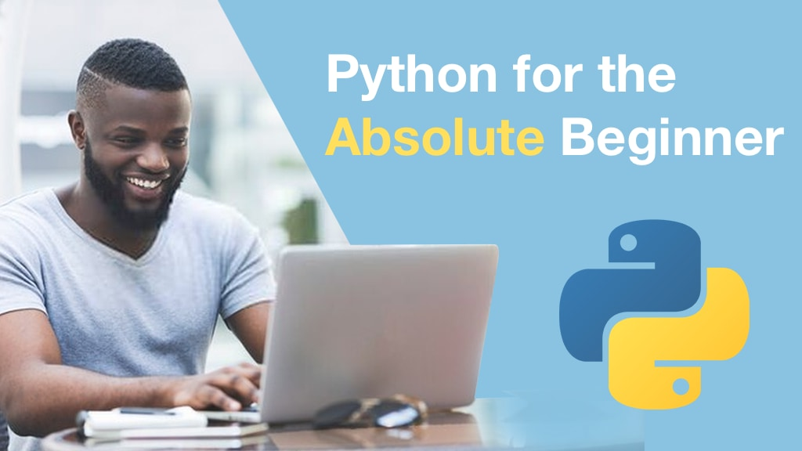

# Python for Absolute Beginners Course

Code samples and other handouts for our course. See the [**practice exercises**](/practices) for following along with the course.

## Course Summary

Learning to program can be overwhelming. Concepts and facts come at you fast and most courses don't cover many of them at all or at a beginner's pace. **This is not most courses**. Python for absolute beginners is our premier course for beginning developers. We start at the very beginning, teaching you the big ideas and concepts covered in a CS 101 course. Then we move on to writing increasingly complex code and applications in Python.

## What students are saying

Python for Beginners was really well done, I have CodeAcademy and LinkedIn Learning (not bad mouthing them) but until I had your program I was really struggling. Course curriculum is very good. Thanks for putting this together. 

## What's this course about and how is it different?

Most courses teach you the *facts* of programming and Python. Here is
how a loop is constructed. Here is how you test a condition and make
your program choose one path or another. Often they assume that you are
familiar with programming concepts such as data types, loops, functions, 
and so on and that you just need to learn the details of how to do this in 
Python.

**This course is not most courses**. If you want ground up coverage of 
software development using Python as the technology, this is your course!

We spend significant time setting the stage to make sure you have 
the big concepts clearly covered before diving into writing code. We
explicitly discuss how to approach problem solving when writing code
so that you don't have that *deer in the headlines* feeling.
 
And the course content isn't just facts. You will see a lot of code 
written before your eyes. That code isn't boring `foo()` this and
`bar()` that. **We build several fun and challenging games covering a wide
range of topics** that will be entirely relevant to your professional
projects.

If you never had that formal computer science background but need to
jump into programming and Python, this course has your back.

## What topics are covered

In this course, you will:

* Learn how to install Python and a proper editor to write code on your computer.
* See a quick, high-level overview of the *big ideas* of computer programming (e.g. data structures).
* Understand how Python executes a program and turns what you write into executable software.
* See how Python defines data types (integers, strings, etc.) and how to convert between them.
* Create interactive code that has a *conversation* with the user or data.
* Use functions to make your code more maintainable and reusable.
* Choose the right data structure to significantly improve the clarity and performance of your code.
* Create a basic AI / computer opponent for the games built during the course.
* Learn many problem solving techniques to help you dive right into writing code productively.
* See resources to help visualize connections between data created by your code.
* Work with multiple file formats to read and write data as our program runs.
* Use external libraries from [pypi.org](https://pypi.org).
* Add error handling to your application for a polished, reliable application.
* And lots more

View the full [course outline](https://training.talkpython.fm/courses/explore_beginners/python-for-absolute-beginners#course_outline).

## Who is this course for?

This course is for **anyone who wants to learn Python and computer programming**. If you haven't had a formal education in software development or have tried other courses and programming "didn't stick", then you are a great candidate student.

The student requirements are quite light for this course. You'll need:

* Basic typing skills
* Foundational computer experience (installing software etc.) 
* A simple computer (macOS, Windows, or Linux)
* A desire to learn programming

**Note**: All software used during this course, including editors, Python language, etc., are 100% free and open source. You won't have to buy anything to take the course.

## What games will we build?

I believe it's important to learn programming in the context of something that feels plausible and real. We won't build a bunch of disconnected loops and other programming examples that don't relate back to real programs. We  will build several fun games that cover meaningful content that any elementary 
Python course would cover.

1. **Guess the number of M&Ms in a jar**
2. **TIC-TAC-TOE**
3. **Rock-Paper-Scissors (3-way and 7-way)**
4. **A Connect4 clone**

## The time to act is now

If you've always wanted to learn programming and are considering Python as your gateway into that world, this is the course for you. We will fill in the concepts that would normally be covered in a CS 101 course without wasting your time taking semesters to cover what can be learned and practiced in a week or two.

Dive into Python and become a software developer with this course. Join today! You've got nothing to lose. Every one of our courses comes with a 2-week money-back guarantee.

Visit the [**course page to sign up**](https://training.talkpython.fm/courses/explore_beginners/python-for-absolute-beginners).
