# Gallery: Chapter 01 - Welcome to the Course

Figure 1: [Should you be a programmer?](figures/0102-hero.png)

[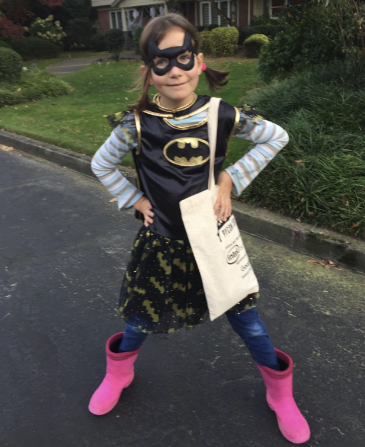](figures/0102-superhero.png)
Figure 2: [A programming superhero](figures/0102-superhero.png)

[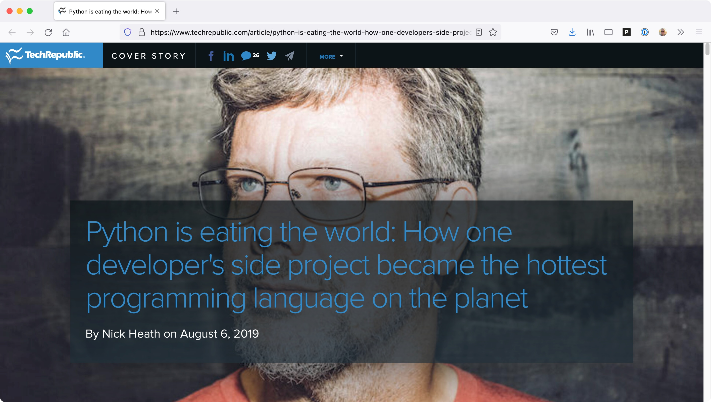](figures/0103-hero.jpg)
Figure 3: [Python is Eating the World article](figures/0103-hero.jpg)

[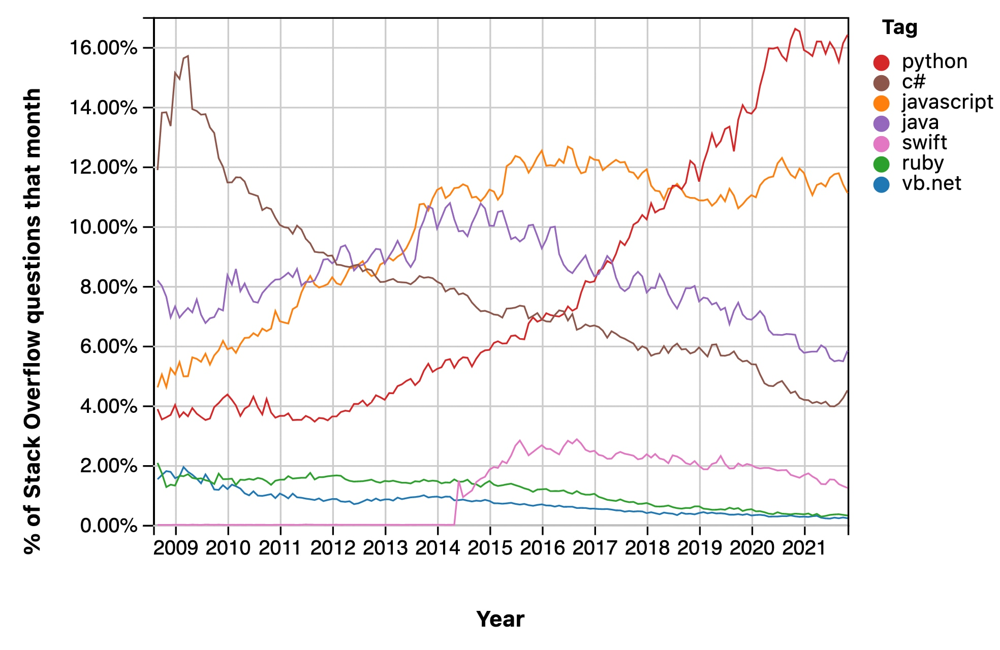](figures/0103-graph.jpg)
Figure 4: [Stack Overflow Trends showing Python's growth](figures/0103-graph.jpg)

[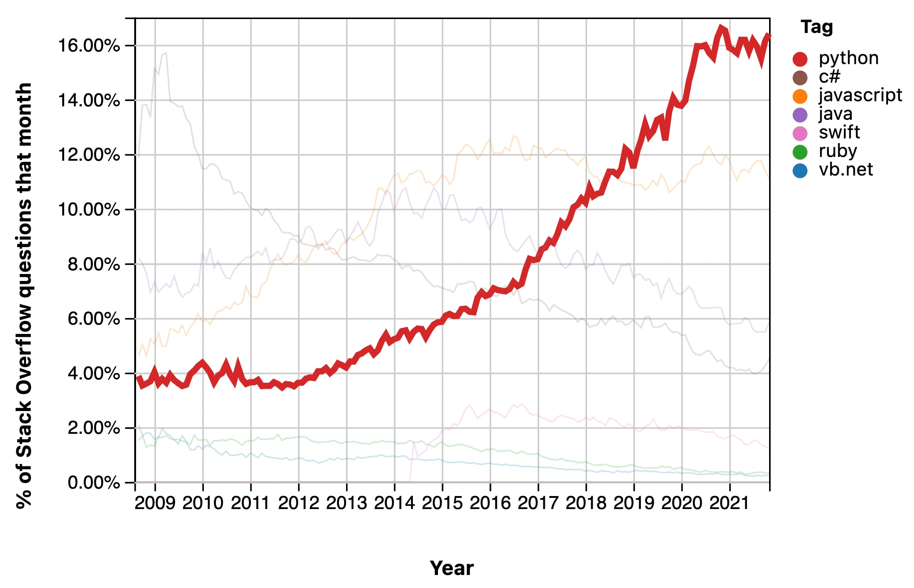](figures/0103-graph_2.jpg)
Figure 5: [Stackoverflow Trends showing Python's growth (highlighted)](figures/0103-graph_2.jpg)

[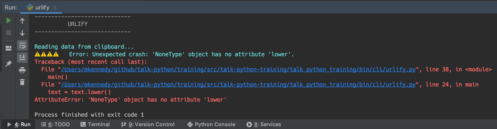](figures/0106-error_screen.png)
Figure 6: [A syntax error in a Python application](figures/0106-error_screen.png)

[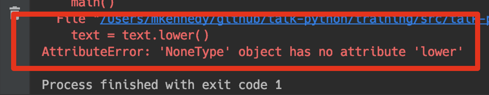](figures/0106-error_screen_detail.png)
Figure 7: [Exception details will show the direct cause at the bottom](figures/0106-error_screen_detail.png)

[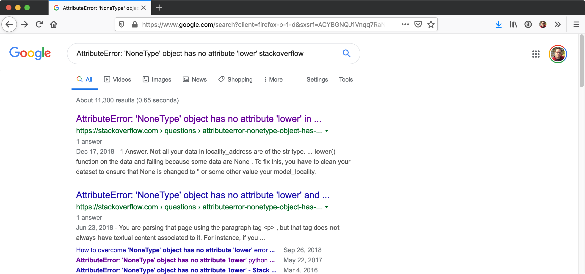](figures/0106-google_error.png)
Figure 8: [Google the error message](figures/0106-google_error.png)

[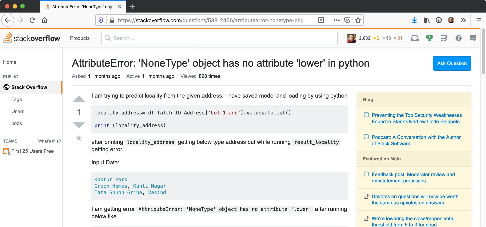](figures/0106-stackoverflow.png)
Figure 9: [Check Stack Overflow for an answer](figures/0106-stackoverflow.png)

[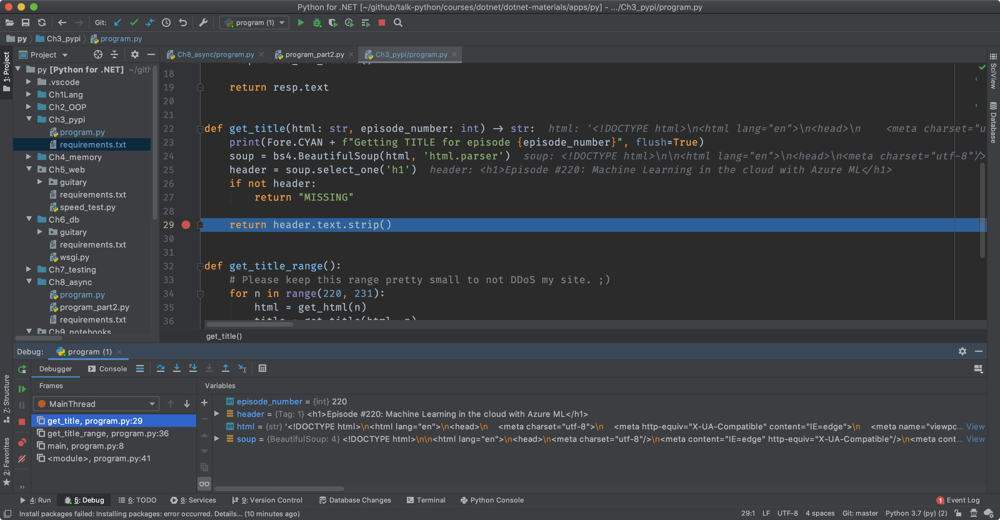](figures/0106-debugger.png)
Figure 10: [Use a debugger (in PyCharm) to see variable values](figures/0106-debugger.png)

[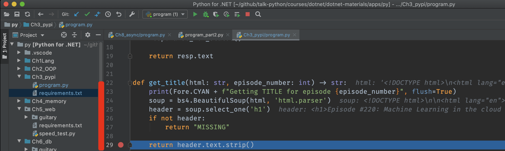](figures/0106-debugger_2.png)
Figure 11: [Value of variables in the editor (grey text)](figures/0106-debugger_2.png)

[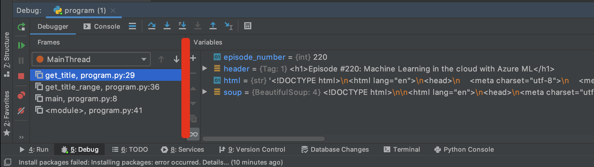](figures/0106-debugger_3.png)
Figure 12: [Value of variables in the watch window](figures/0106-debugger_3.png)

[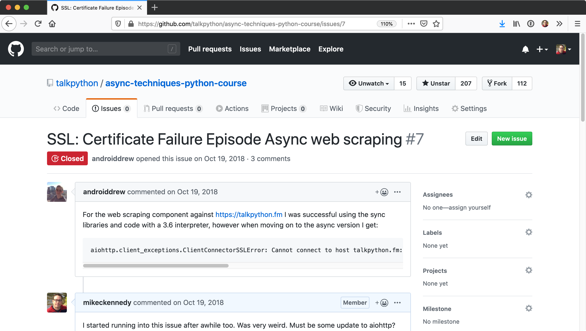](figures/0106-repository.png)
Figure 13: [Check the course's GitHub repository](figures/0106-repository.png)

[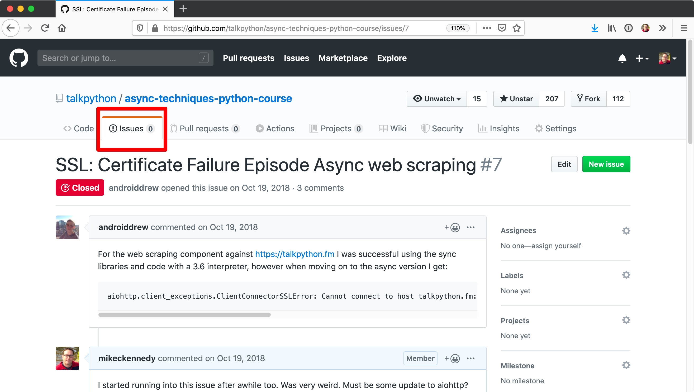](figures/0106-repository_2.jpg)
Figure 14: [Focus on the issues (there may be closed ones too)](figures/0106-repository_2.jpg)

[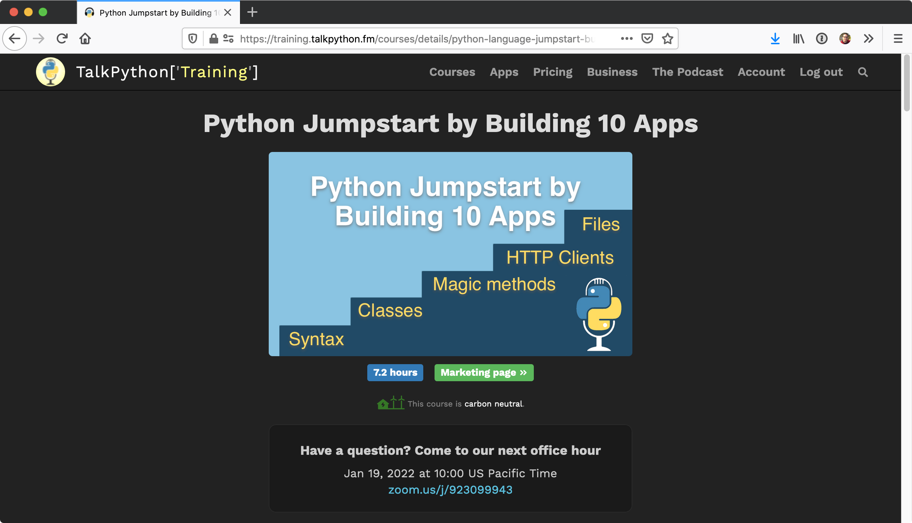](figures/0106-office_hours.png)
Figure 15: [Join the live Office Hours at Talk Python](figures/0106-office_hours.png)

[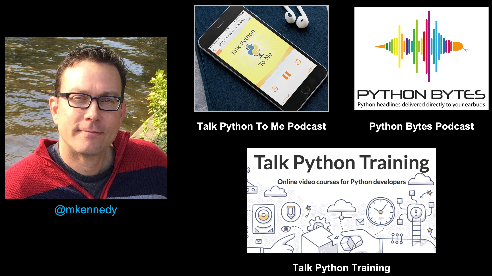](figures/0107-hero.jpg)
Figure 16: [Michael Kennedy: Host @ Talk Python and Python Bytes, Founder Talk Python Training](figures/0107-hero.jpg)

**LICENSE**: Images in the figure gallery are copyright and not available for reuse. 

