# Gallery: Chapter 02 - Course Setup and Requirements

[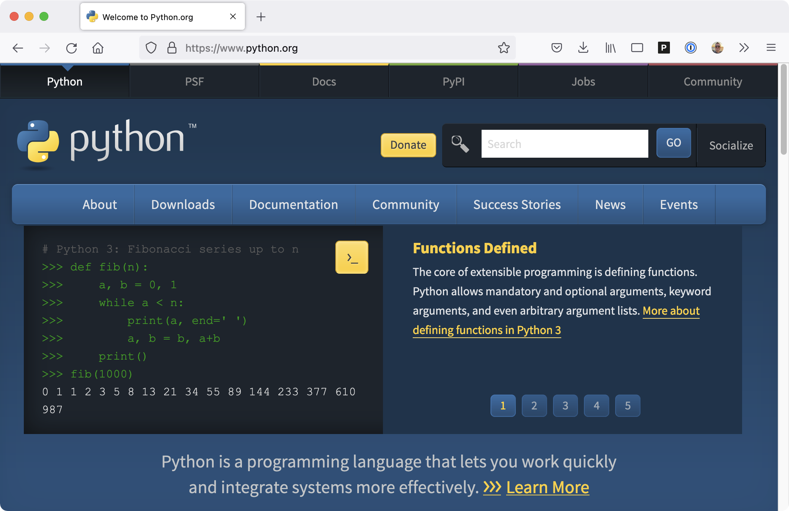](figures/0201-download_python.png)
Figure 1: [Download Python for your OS at python.org](figures/0201-download_python.png)

[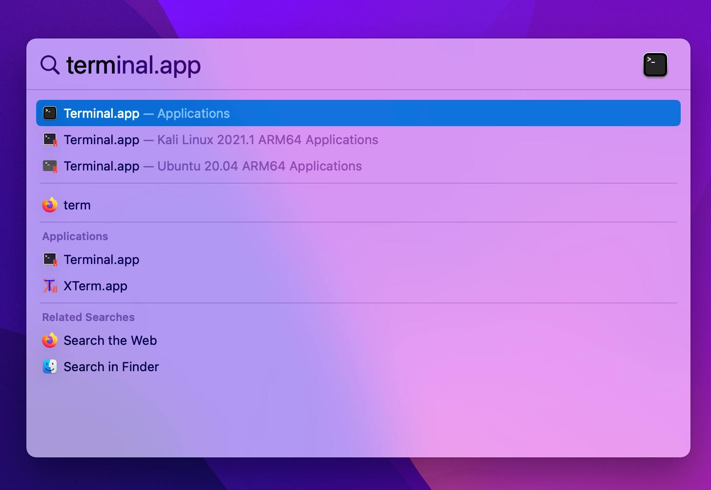](figures/0201-terminal.jpg)
Figure 2: [Launch **Terminal** on macOS with Spotlight (CMD+Space)](figures/0201-terminal.jpg)

Figure 3: [Launch **Terminal** on macOS via **Finder**](figures/0201-terminal_2.png)

[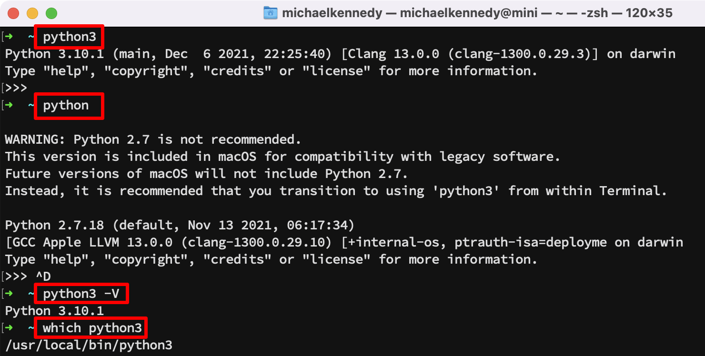](figures/0201-python_version.png)
Figure 4: [Check your Python version on macOS and Linux](figures/0201-python_version.png)

[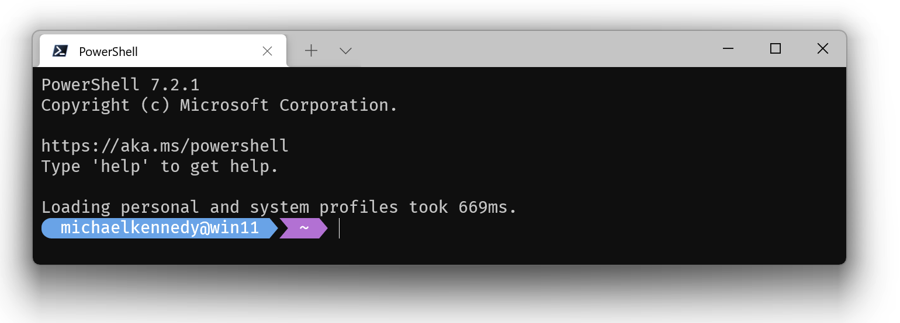](figures/0202-terminal.png)
Figure 5: [Check your Python version on Windows](figures/0202-terminal.png)

[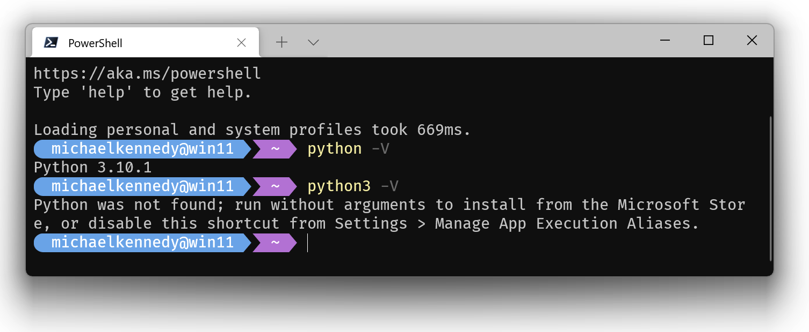](figures/0202-python3.png)
Figure 6: [Python3 might be the Windows Store shim](figures/0202-python3.png)

[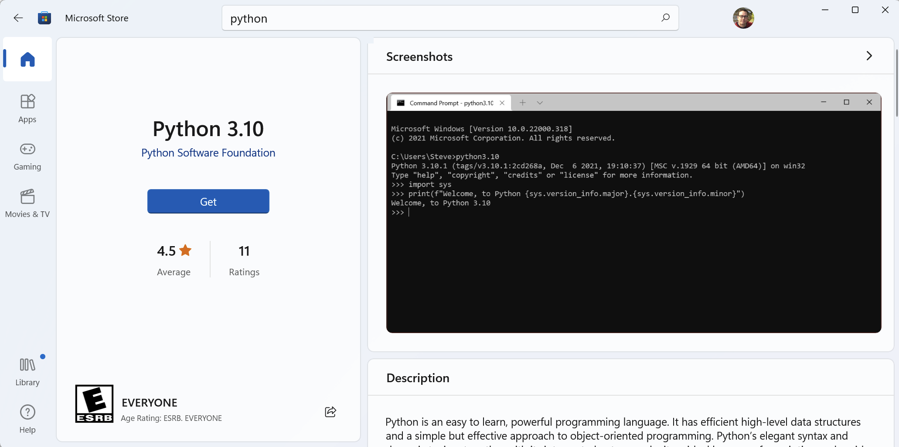](figures/0202-windows_store.png)
Figure 7: [Python 3 in the Windows Store](figures/0202-windows_store.png)

Figure 8: [Using the `where python` command to explore Windows path](figures/0202-where_python.png)

Figure 9: [Using the `where python3` command to explore Windows path](figures/0202-where_python3.png)

[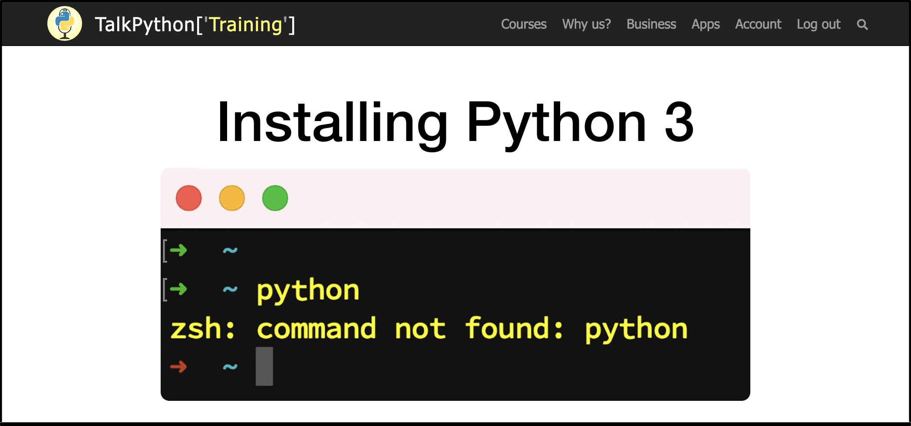](figures/0203-install-python.png)
Figure 10: [Python installation guide at Talk Python Training](figures/0203-install-python.png)

[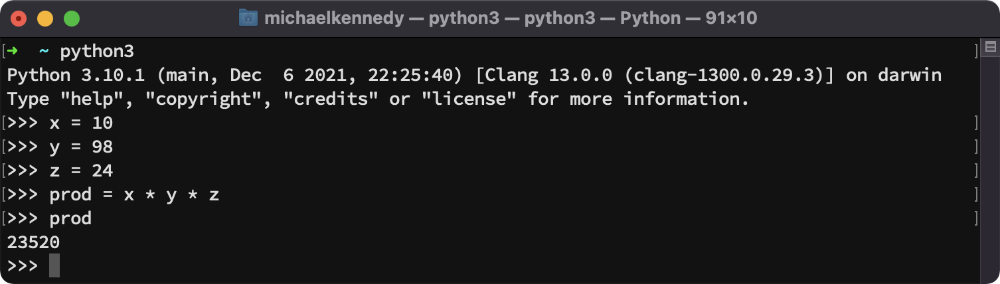](figures/0204-code_editor_level_1.png)
Figure 11: [Code Editor Level 1: The Python REPL](figures/0204-code_editor_level_1.png)

Figure 12: [Code Editor Level 2: Install PyCharm](figures/0204-code_editor_level_2.png)

[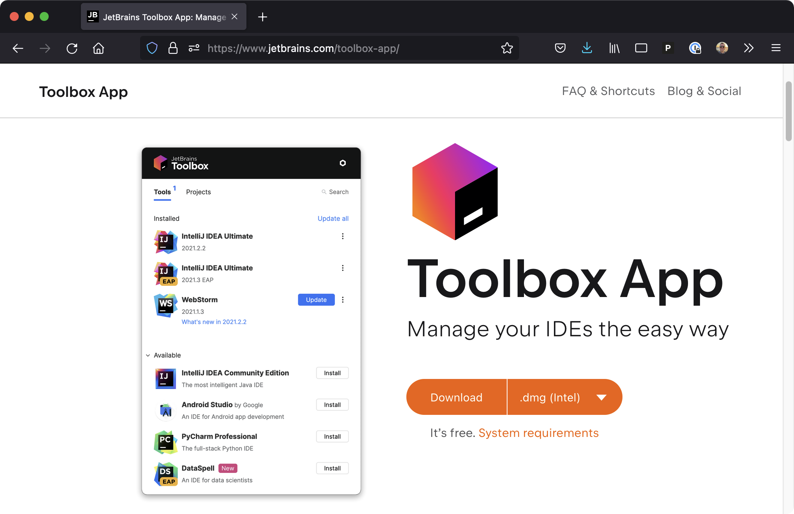](figures/0204-jetbrains_toolbox.png)
Figure 13: [Manage PyCharm and other tools using JetBrains Toolbox](figures/0204-jetbrains_toolbox.png)

[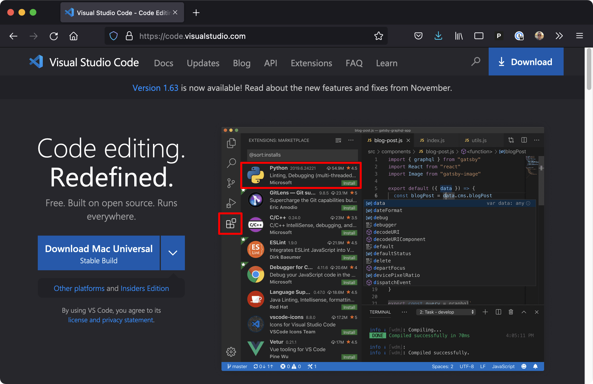](figures/0204-vscode.png)
Figure 14: [Visual Studio Code is a solid other choice for our projects](figures/0204-vscode.png)

[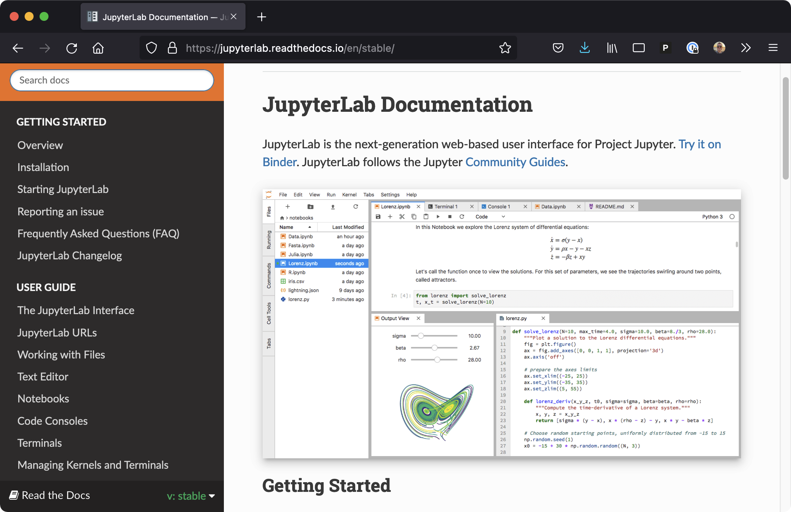](figures/0204-jupyter_notebook.png)
Figure 15: [JupyterLab can be used as an editor for most projects](figures/0204-jupyter_notebook.png)

Figure 16: [The Github repository for code from the course](figures/0205-github_repo.png)

[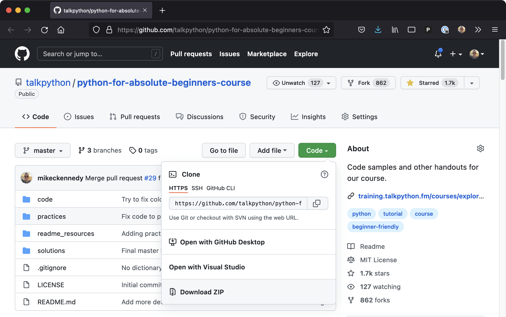](figures/0205-download_repo.png)
Figure 17: [Code can be downloaded without git (green button then download)](figures/0205-download_repo.png)

**LICENSE**: Images in the figure gallery are copyright and not available for reuse. 

