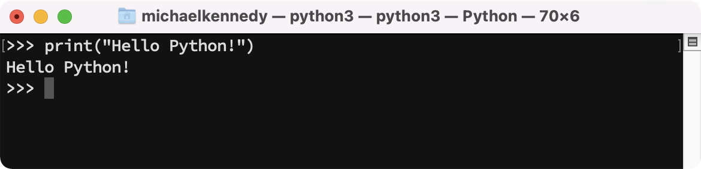
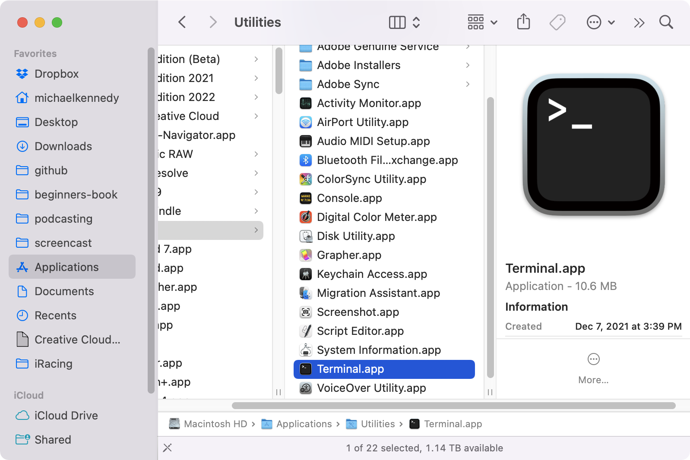
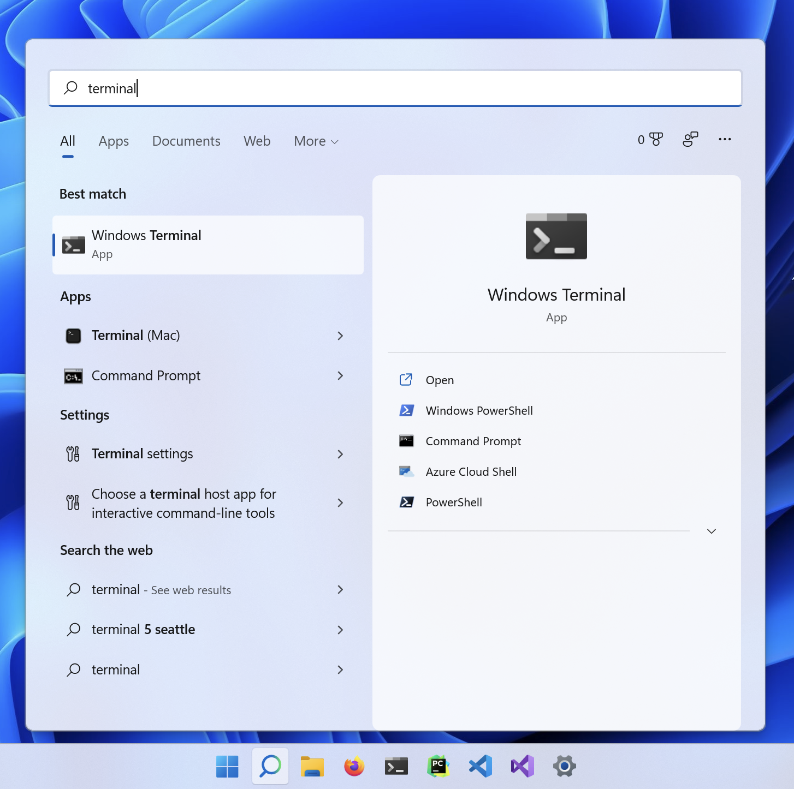
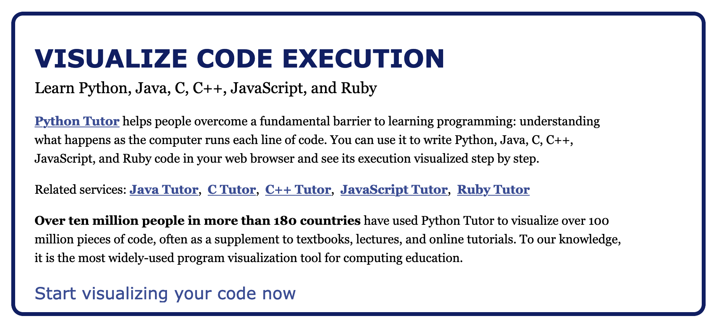
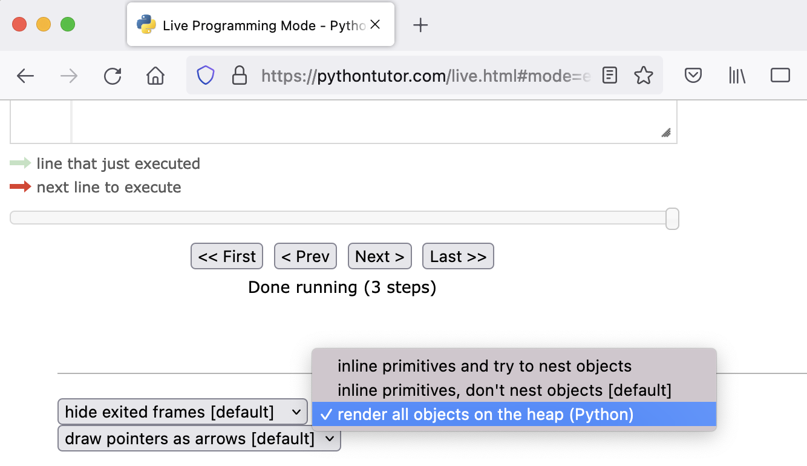
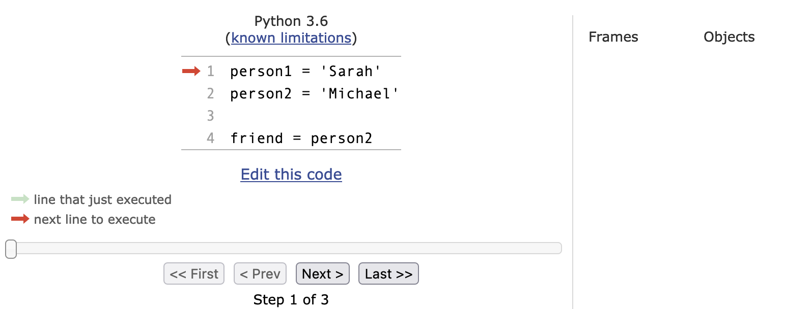
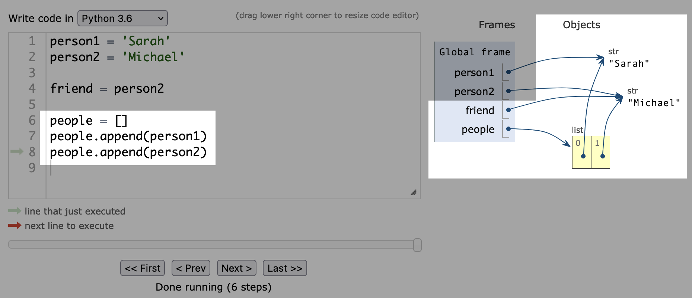
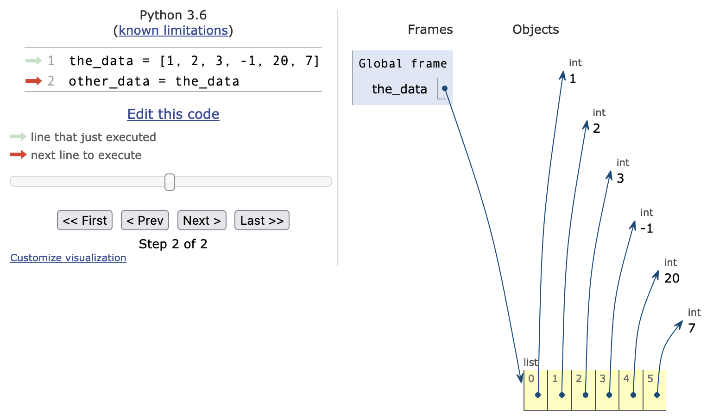
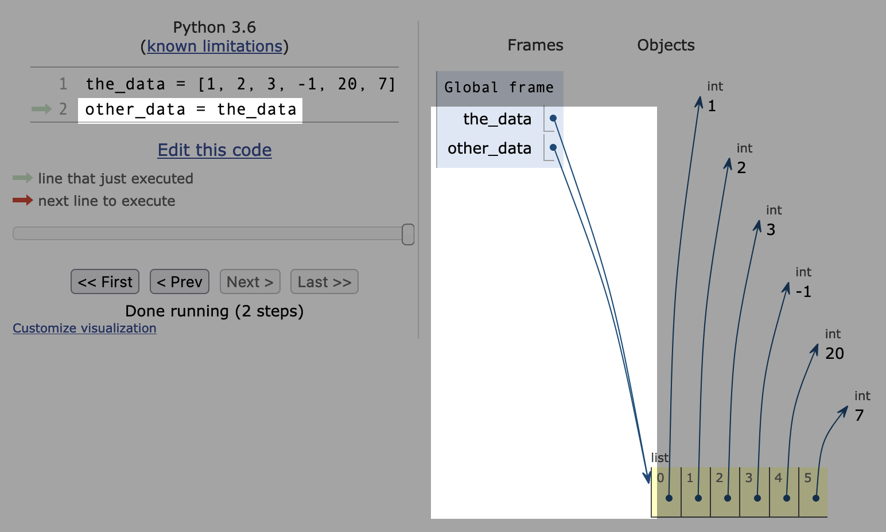
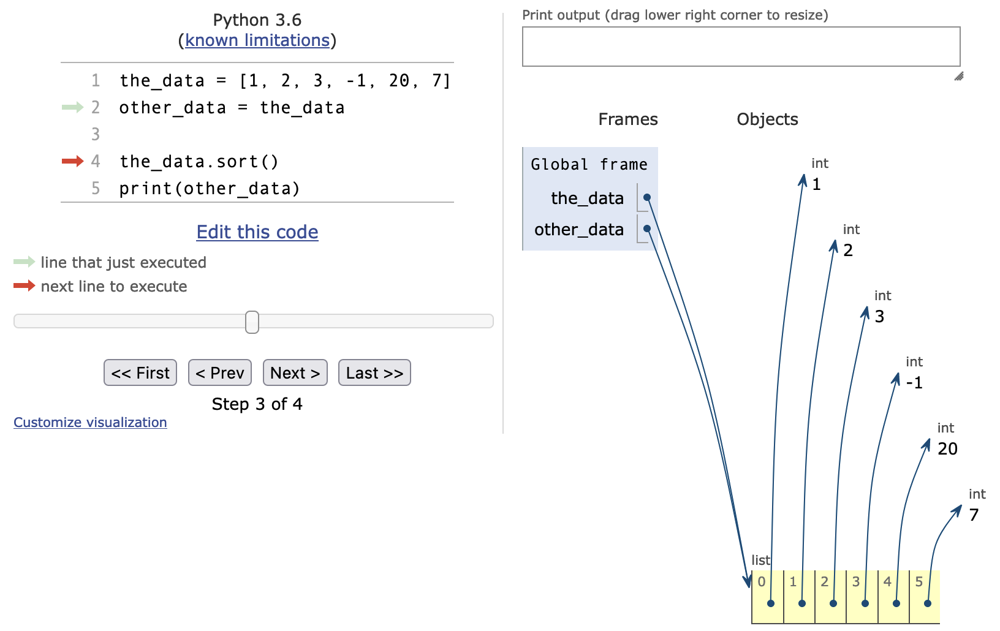

# Gallery: Chapter 04 - Writing your first line of code

Figure 1: [*Hello world* in the macOS REPL](figures/0401-repl_1.png)

Figure 2: [Windows REPL](figures/0401-repl_2.png)

Figure 3: [Launching Terminal in macOS via Applications folder](figures/0402-terminal.png)

Figure 4: [Warning: `python` on macOS/Linux might mean Python 2](figures/0402-python2.png)

Figure 5: [When in doubt, use the `python3` command on macOS / Linux](figures/0402-python3.png)

Figure 6: [Launching Windows Terminal via the Start Menu on Windows 11](figures/0403-cmd.png)

Figure 7: [`python` on Windows usually means Python 3](figures/0403-python.png)

Figure 8: [Using the `where python` command to explore the Python and installed versions](figures/0403-where_python.png)

Figure 9: [Python 3.10 is first in the path, so `python` runs that one](figures/0403-hello_world.png)

Figure 10: [PythonTutor.com has useful visualization tools for Python code](figures/0407-python_tutor.png)

Figure 11: [Be sure to select "render all objects on heap" to replicate](figures/0407-python_tutor_setting.png)

Figure 12: [Step 1: No code has executed yet](figures/0407-python_tutor_execution.png)

Figure 13: [Step 2: A single variable `person1` has been created](figures/0407-python_tutor_step_1.png)

Figure 14: [Step 3&4: New value `"Michael" shared by `person2` and `friend`](figures/0407-python_tutor_step_2.png)

Figure 15: [Step 5: people list created holding (shared) values of person 1 and 2](figures/0407-python_tutor_step_3.png)

Figure 16: [Step 6: An independent new value is assigned to `person3`](figures/0407-python_tutor_step_4.png)

Figure 17: [Visualize a list pointing to held objects](figures/0408-python_tutor_list.png)

Figure 18: [Sharing the list across variables shares the same data structure](figures/0408-python_tutor_list_2.png)

Figure 19: [The list before sorting](figures/0408-python_tutor_list_3.png)

Figure 20: [After sorting, both `the_data` and `other_data` are updated](figures/0408-python_tutor_list_4.png)

