# Gallery: Chapter 05 - Code that interacts with users

[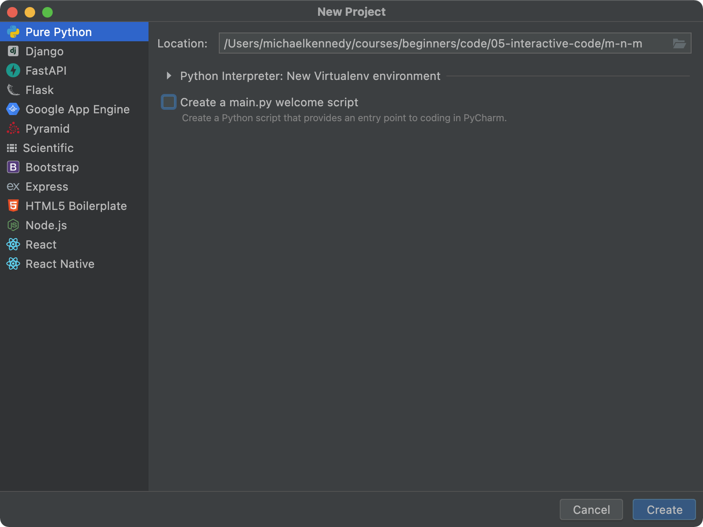](figures/0503-pycharm_1.png)
Figure 1: [Creating a new Python project using PyCharm (type selection)](figures/0503-pycharm_1.png)

[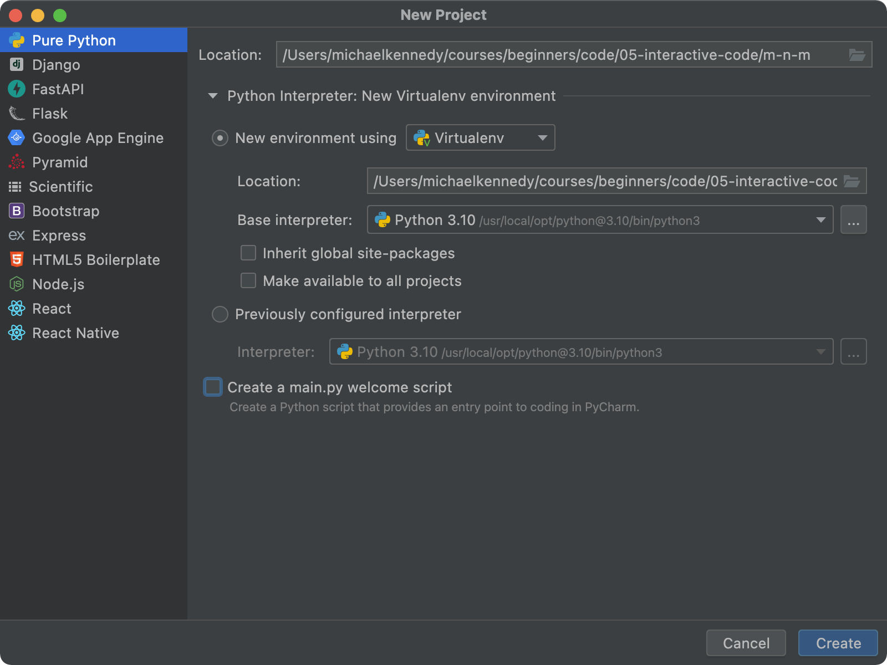](figures/0503-pycharm_2.png)
Figure 2: [Creating a new Python project using PyCharm (settings)](figures/0503-pycharm_2.png)

[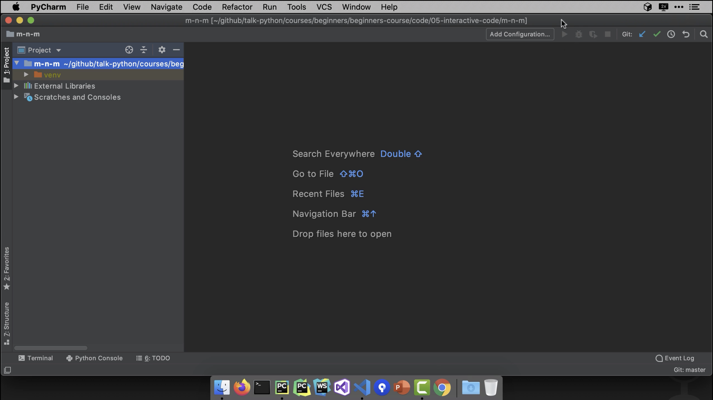](figures/0503-pycharm_3.png)
Figure 3: [PyCharm with our brand new (empty) project loaded](figures/0503-pycharm_3.png)

Figure 4: [Beginnings of our `print` line](figures/0503-pycharm_4.png)

[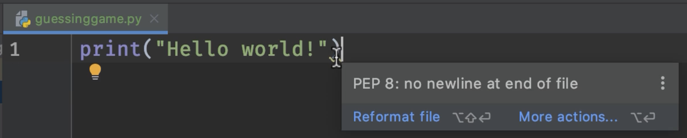](figures/0503-pycharm_5.png)
Figure 5: [PEP8 error: no newline at end of file](figures/0503-pycharm_5.png)

[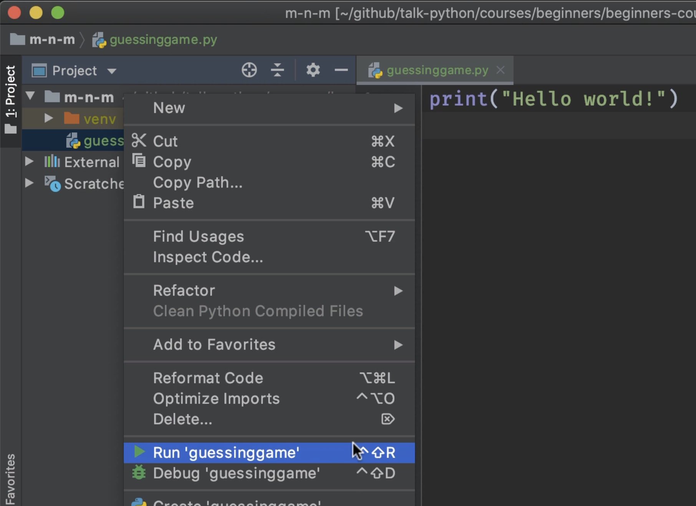](figures/0503-pycharm_6.png)
Figure 6: [Running our simple Python file](figures/0503-pycharm_6.png)

[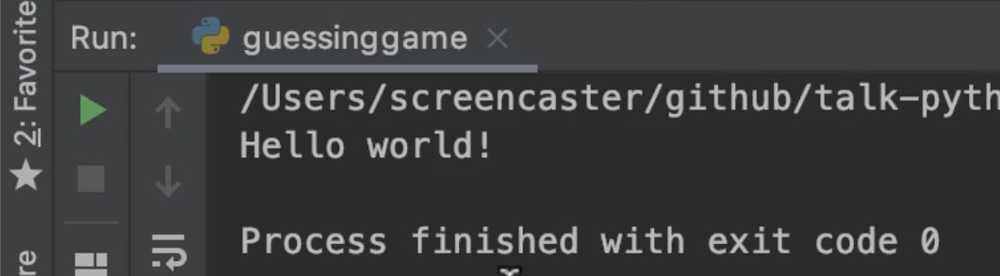](figures/0503-pycharm_7.png)
Figure 7: [Output of our program in the PyCharm run window](figures/0503-pycharm_7.png)

[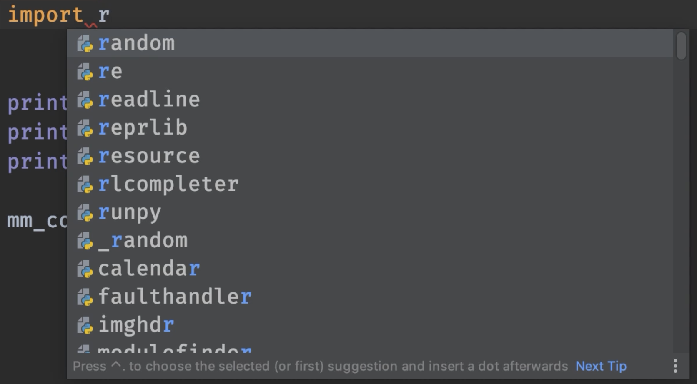](figures/0504-dropdown.png)
Figure 8: [PyCharm's autocomplete helps us write our import statements](figures/0504-dropdown.png)

[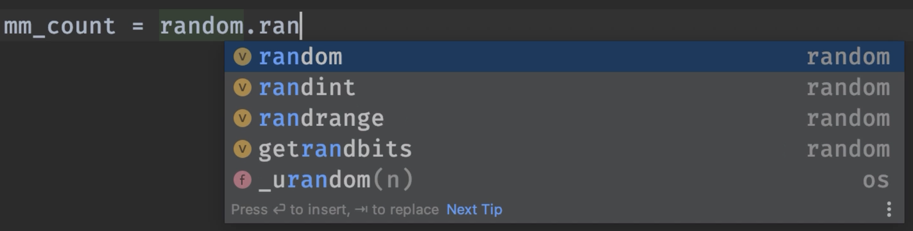](figures/0504-dropdown_2.png)
Figure 9: [PyCharm also autocompletes symbols in the editor](figures/0504-dropdown_2.png)

[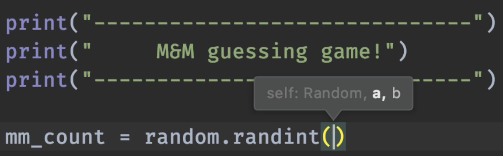](figures/0504-parameters_message.png)
Figure 10: [PyCharm will show which parameters are needed in a function call](figures/0504-parameters_message.png)

Figure 11: [Our recent changes are commited in GitHub](figures/0505-github_1.png)

[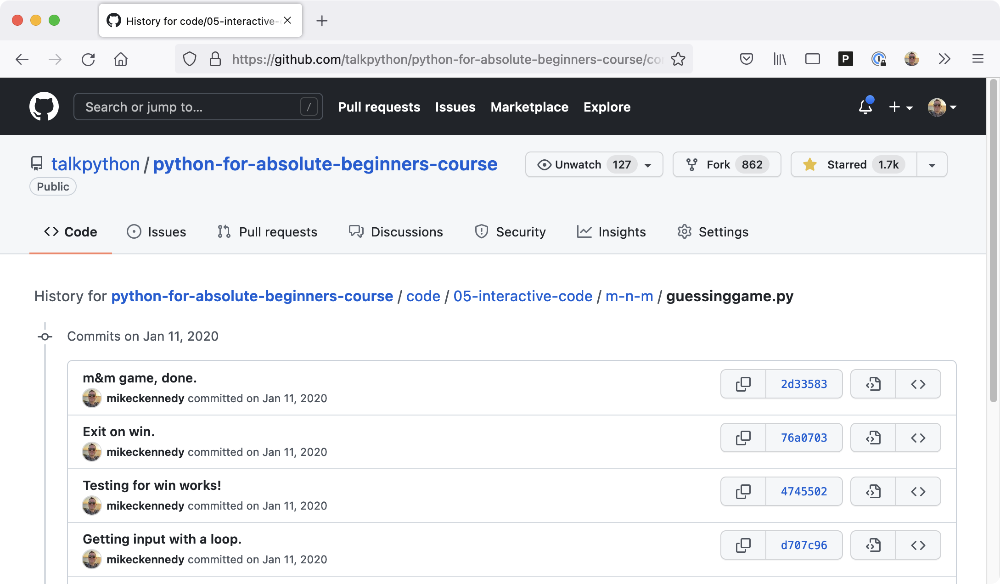](figures/0505-github_history.png)
Figure 12: [GitHub (via git) has great support for history of changes in our code](figures/0505-github_history.png)

Figure 13: [PyCharm supports matching by starting characters](figures/0505-dropdown.png)

Figure 14: [The "launch in debugger" button in PyCharm](figures/0508-debug.png)

[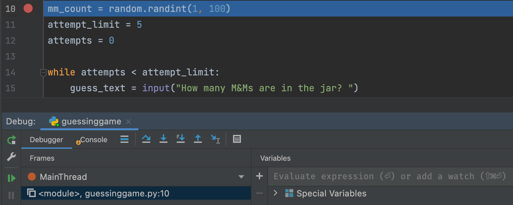](figures/0508-Debug_2.png)
Figure 15: [Debug > Step Over](figures/0508-Debug_2.png)

[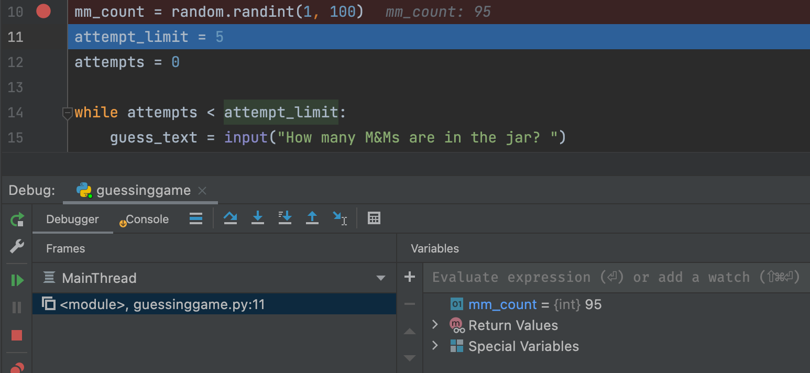](figures/0508-Debug_3.png)
Figure 16: [Seeing variable values in the debugger](figures/0508-Debug_3.png)

[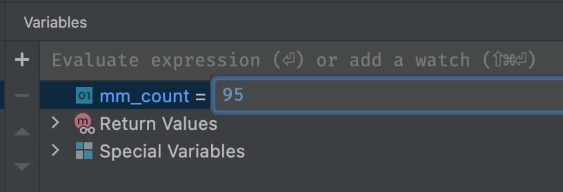](figures/0508-Debug_4.png)
Figure 17: [Modifying the value while paused in the debugger](figures/0508-Debug_4.png)

Figure 18: [Debug: First iteration in the `while` loop](figures/0508-Debug_5.png)

[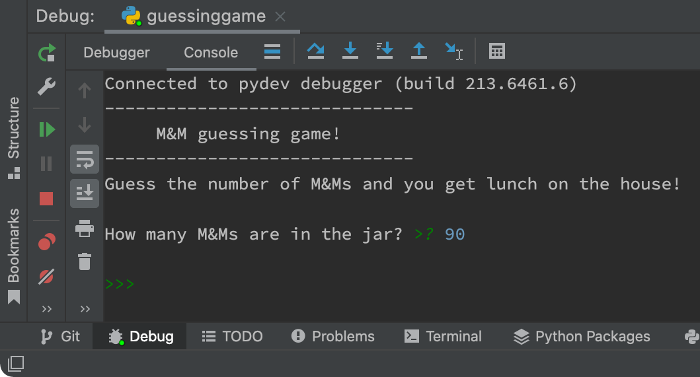](figures/0508-Debug_6.png)
Figure 19: [We could win because we saw the answer in the deubbger, but we'll play](figures/0508-Debug_6.png)

[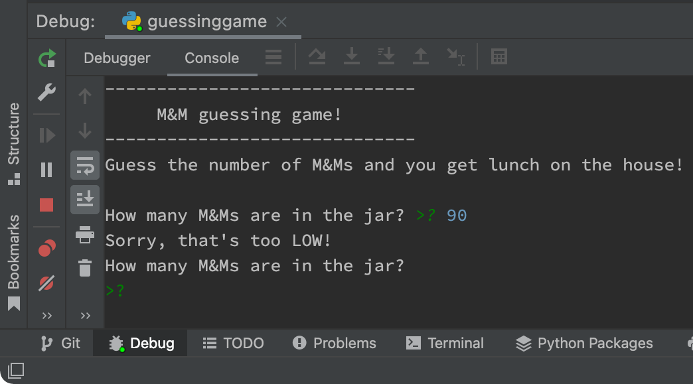](figures/0508-Debug_8.png)
Figure 20: [That guess was too low](figures/0508-Debug_8.png)

[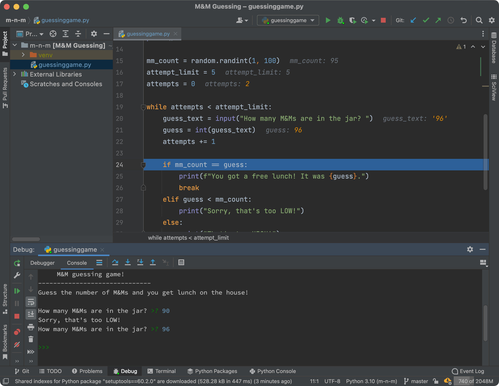](figures/0508-debug_9.png)
Figure 21: [Changed values are shown in **orange** in the editor](figures/0508-debug_9.png)

[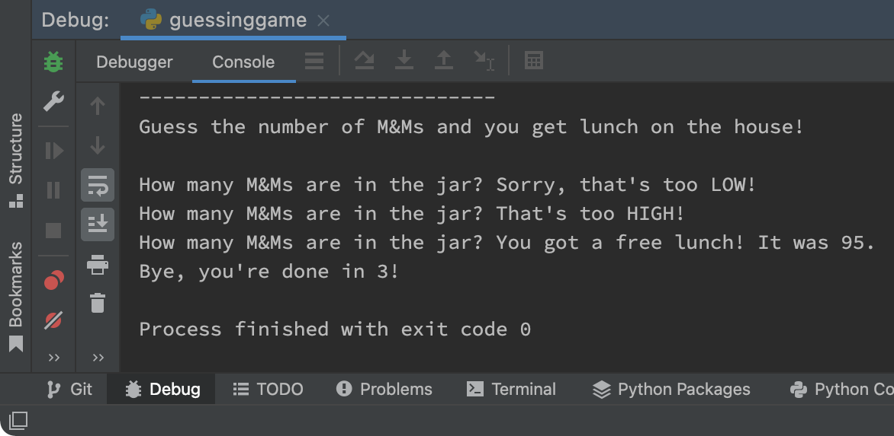](figures/0508-debug_10.png)
Figure 22: [Debugging ends when the process exits (Debug > Console window)](figures/0508-debug_10.png)

[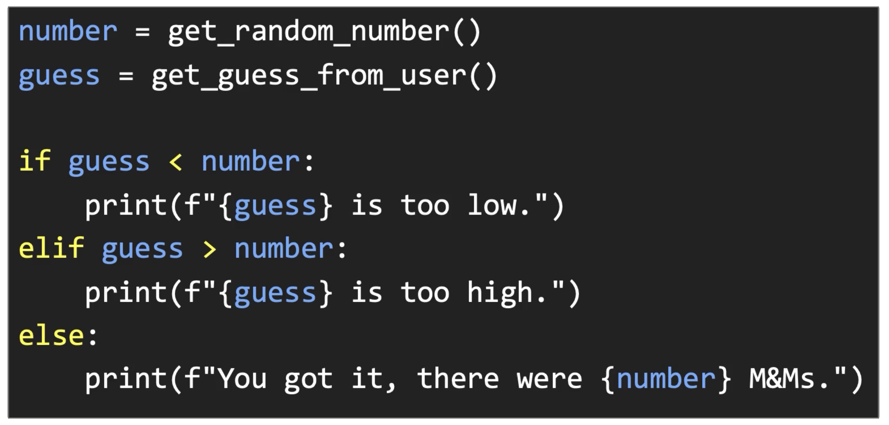](figures/0509-code.png)
Figure 23: [Example of a simple conditional statement in Python](figures/0509-code.png)

[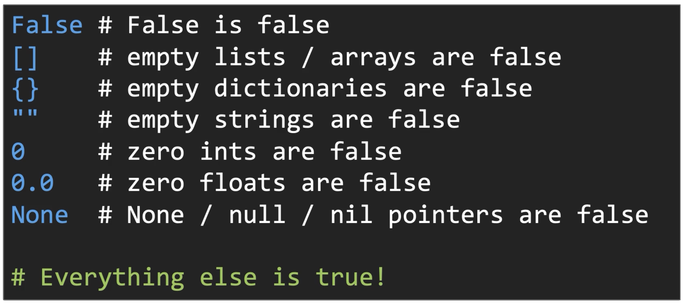](figures/0510-truthiness.png)
Figure 24: [The exhaustive list of things that evaluate to False in Python](figures/0510-truthiness.png)

[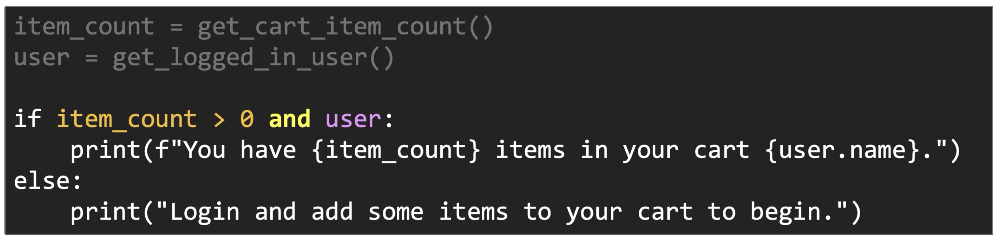](figures/0511-multiple_conditions.png)
Figure 25: [Multiple conditions in a single if statement](figures/0511-multiple_conditions.png)

[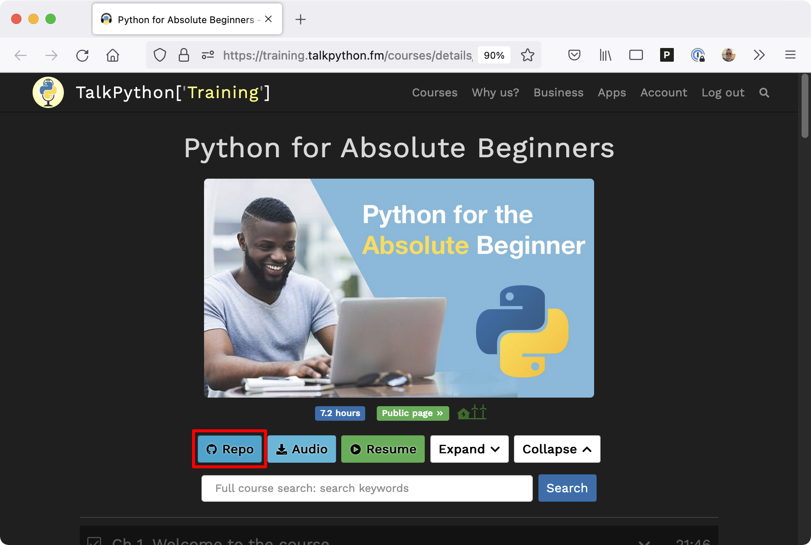](figures/0512-github_repo.png)
Figure 26: [Course page provides quick access to the GitHub repository](figures/0512-github_repo.png)

**LICENSE**: Images in the figure gallery are copyright and not available for reuse. 

