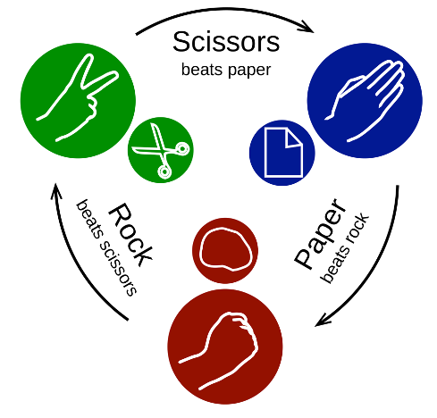
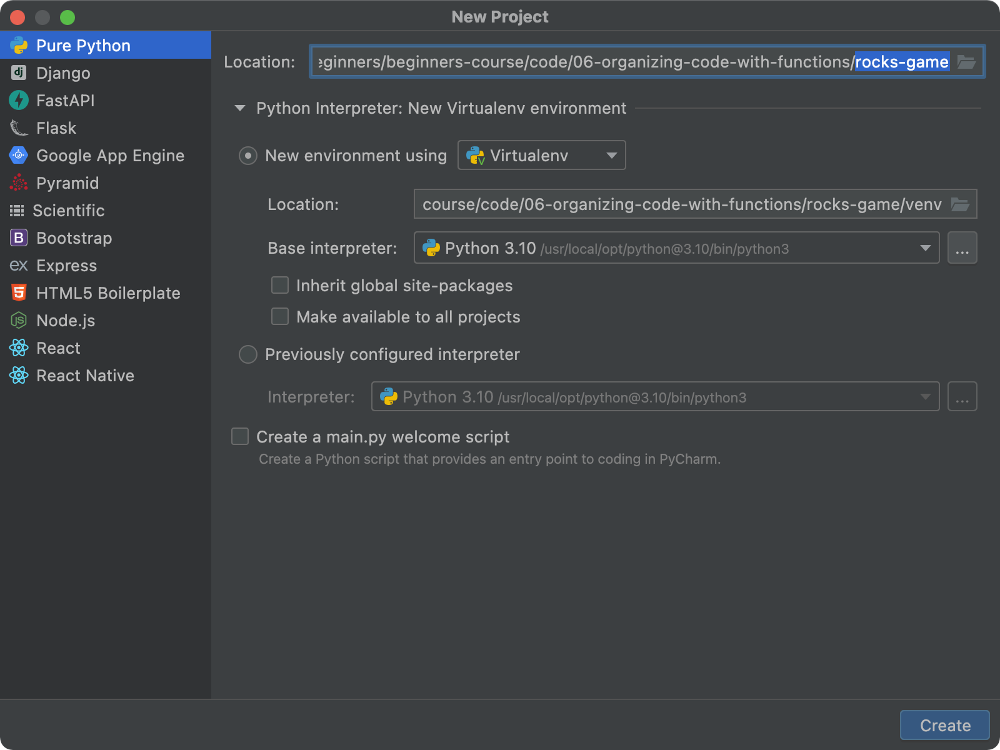
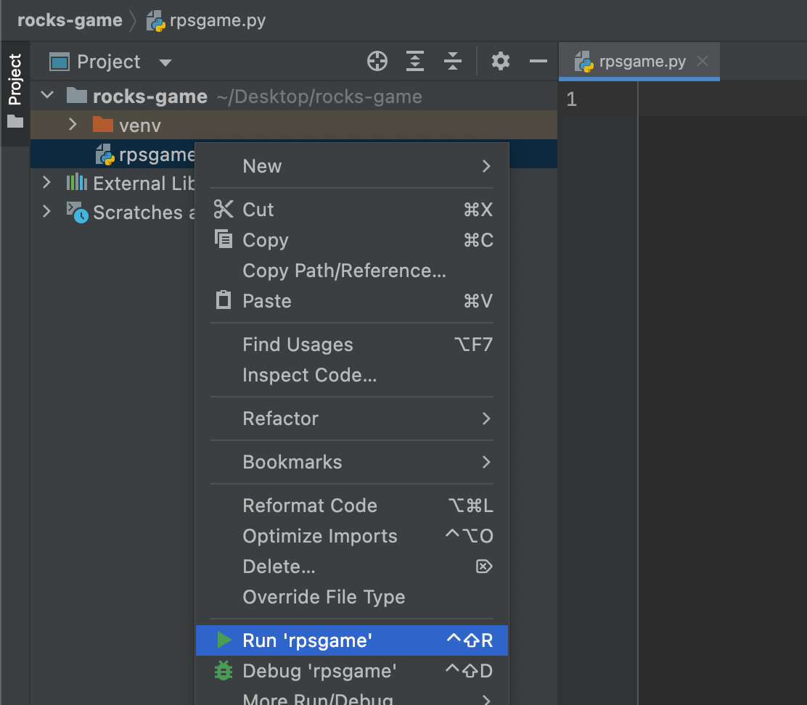
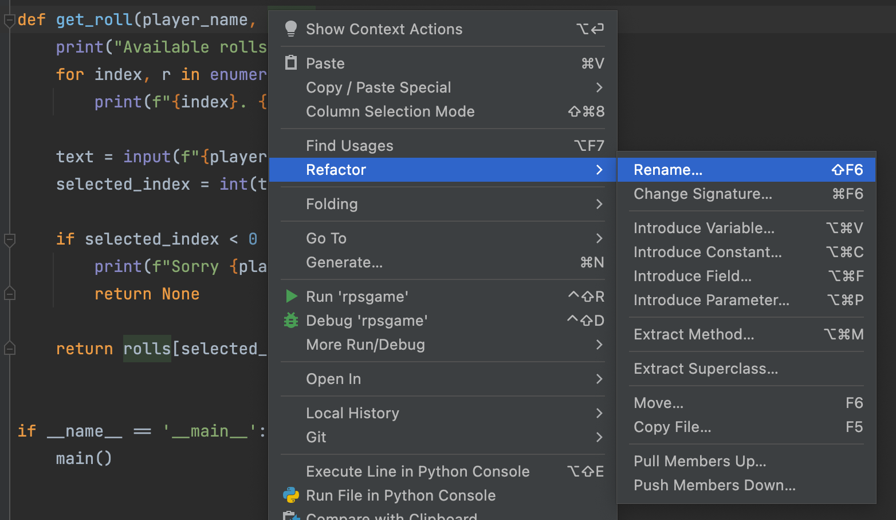
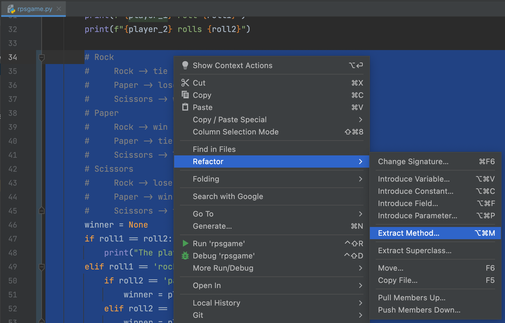
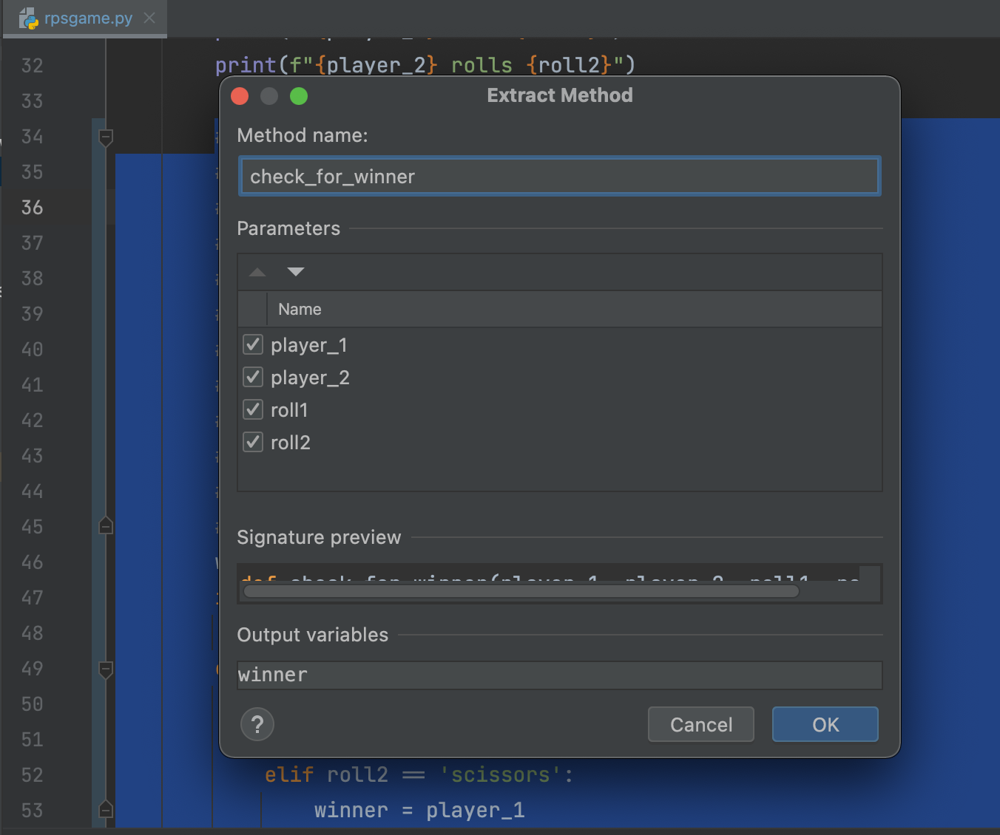
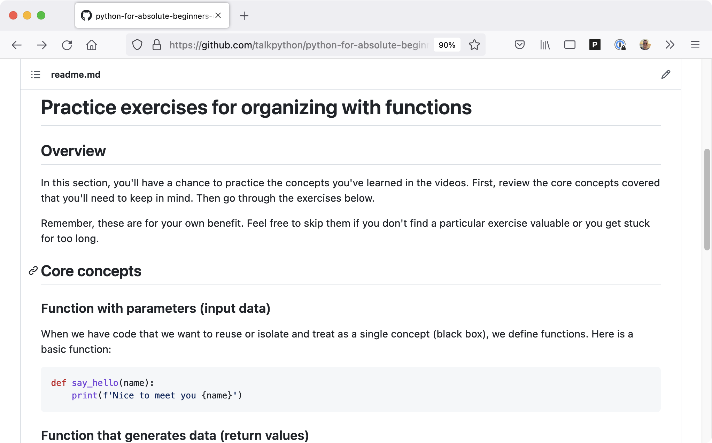

# Gallery: Chapter 06 - Organizing and Reusing Code with Functions

Figure 1: [Rules of the Rock Paper Scissor game](figures/0602-time_for_a_game.png)

Figure 2: [Building games teaches real programming like waxing cars was karate practice](figures/0602-karate_kid.png)

Figure 3: [Creating a new virtual environment in PyCharm](figures/0603-new_env.png)

Figure 4: [Create a run configuration through right-click menu](figures/0603-run.png)

Figure 5: [PyCharm offers "Live Templates", like this `main` pattern](figures/0606-main.png)

Figure 6: [The **rename refactoring** in action](figures/0607-refactor.png)

Figure 7: [**Extract Method** is a powerful way to better organize and understand code](figures/0608-extract_method.png)

Figure 8: [Dialog for finalizing **Extract Method** refactoring](figures/0608-extract_method_2.png)

Figure 9: [Practice execises at the course's GitHub repository](figures/0613-practice.png)

