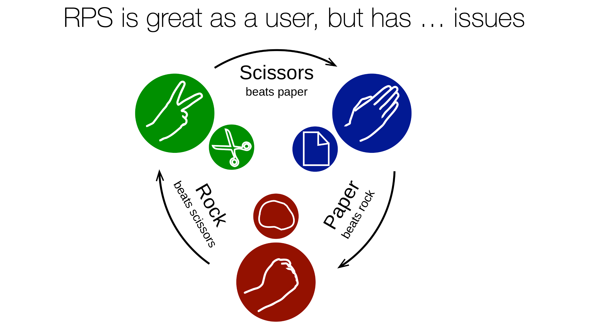
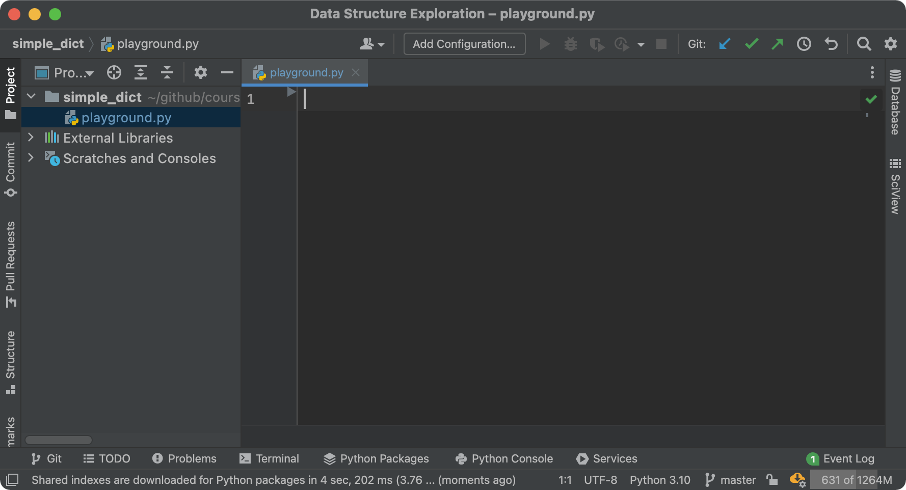
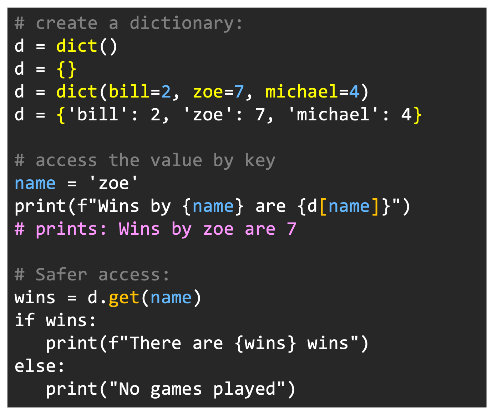
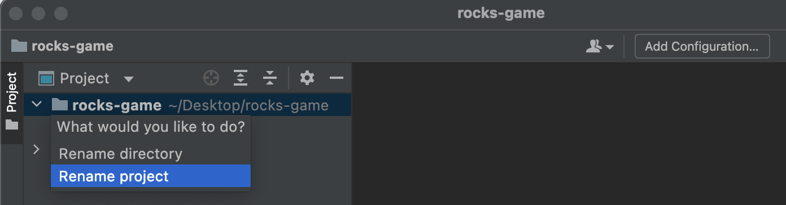
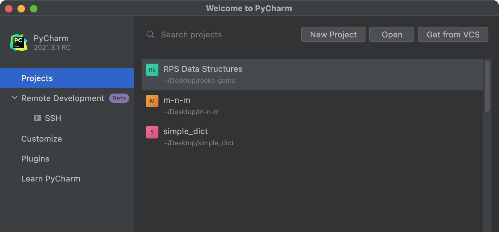
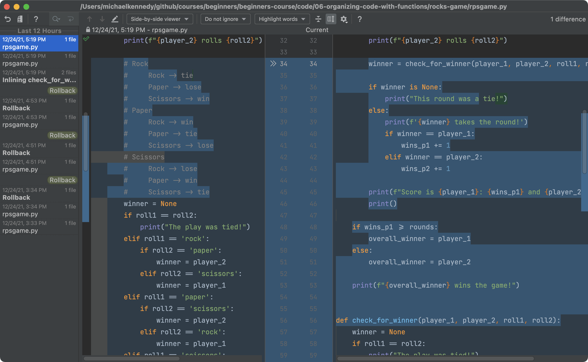
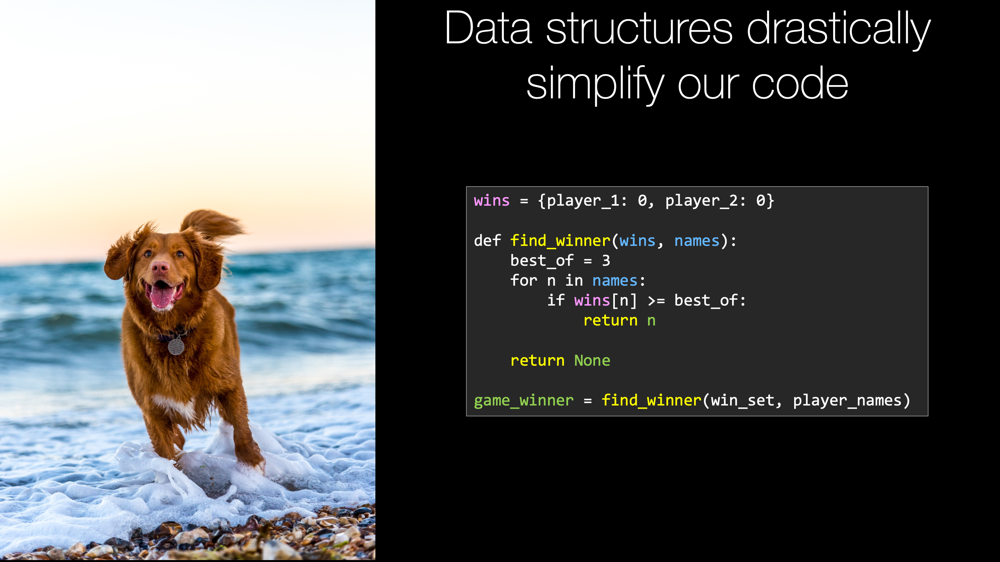
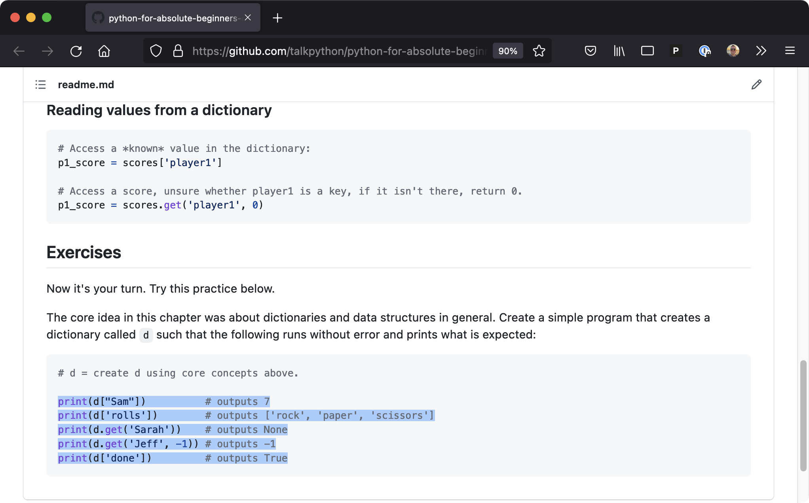

# Gallery: Chapter 07 - Cleaner Code with Common Data Structures

Figure 1: [Our Rock Paper Scissors implementation works but ...](figures/0702-rps.png)

Figure 2: [`play_round()` works but it's not pretty](figures/0702-wat.png)

Figure 3: [Reading and maintaining `play_round()` is not easy](figures/0702-problems.png)

Figure 4: [Creating the playground to explore fundamental data structures](figures/0703-playground.png)

Figure 5: [You'll find dictionaries permeating the Python ecosystem](figures/0704-dictionaries.png)

Figure 6: [Folder have a non-descriptive or repeatative name? Name your project](figures/0705-project-rename.png)

Figure 7: [Recently used list now shows the improved project name](figures/0705-recently_used.png)

Figure 8: [Local history shows you recent file system changes (unrelated to VCS)](figures/0706-history.png)

Figure 9: [Proper data structures mean happy developers (and dogs)](figures/0708-data_structure.png)

Figure 10: [Complete this code using data structures in *your turn*](figures/0710-practice.png)

**LICENSE**: Images in the figure gallery are copyright and not available for reuse. 

