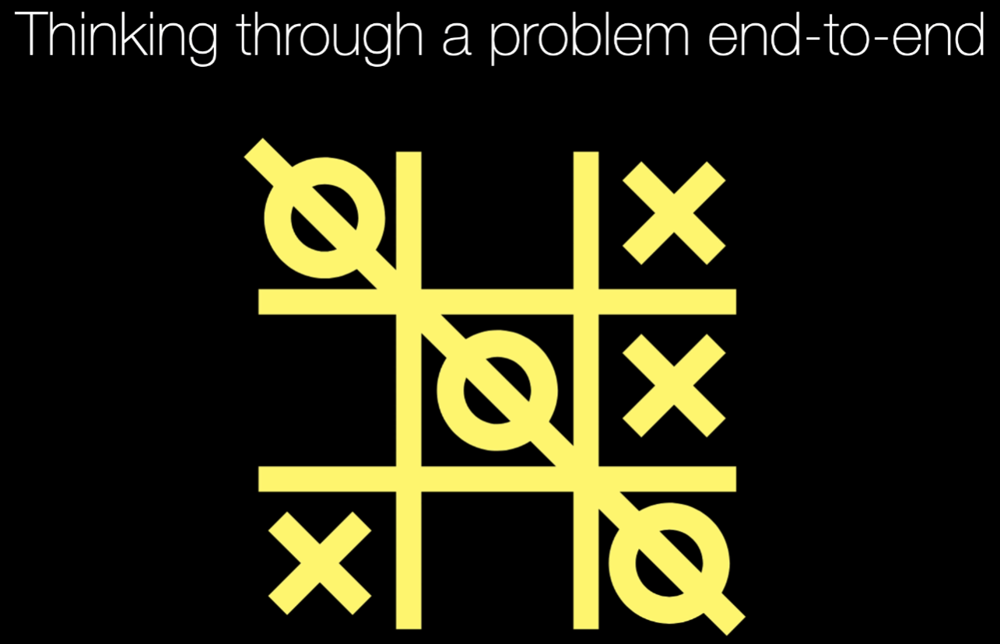
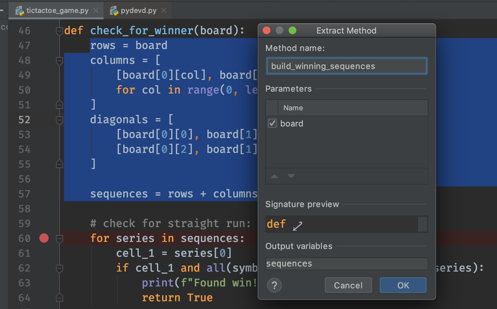
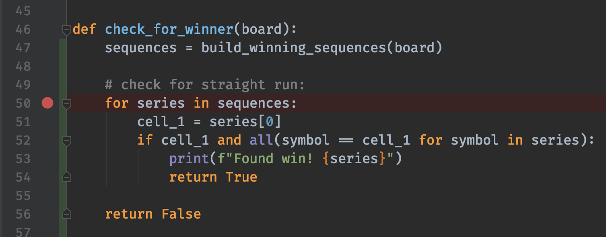
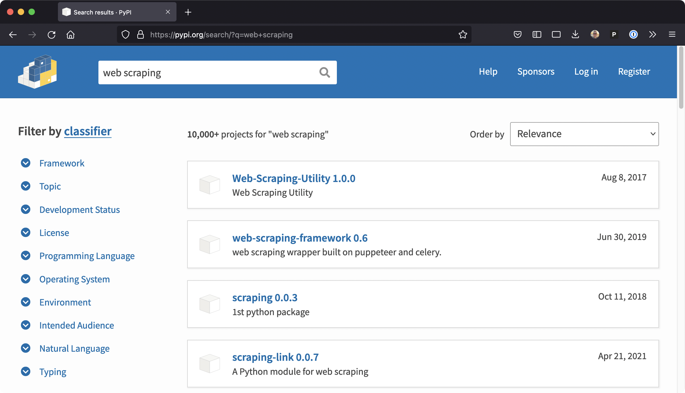

# Gallery: Chapter 08 - Problem-Solving Techniques for Writing Software

Figure 1: [Let's build Tic-Tac-Toe using our techniques](figures/0803-tictactoe.png)

Figure 2: [The debugger is a great tool for understanding data and program flow](figures/0813-debugger.png)

Figure 3: [Refactoring to methods helps think about code as building blocks](figures/0814-refactor.png)

Figure 4: [A simpler view of code now that we've refactored it](figures/0814-refactored.png)

Figure 5: [Libraries that support *web scraping* at PyPI (over 10k)](figures/0815-pypi.png)

**LICENSE**: Images in the figure gallery are copyright and not available for reuse. 

