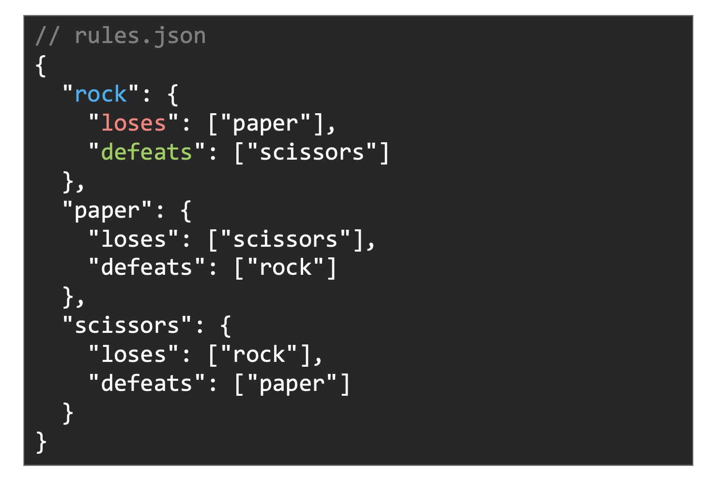
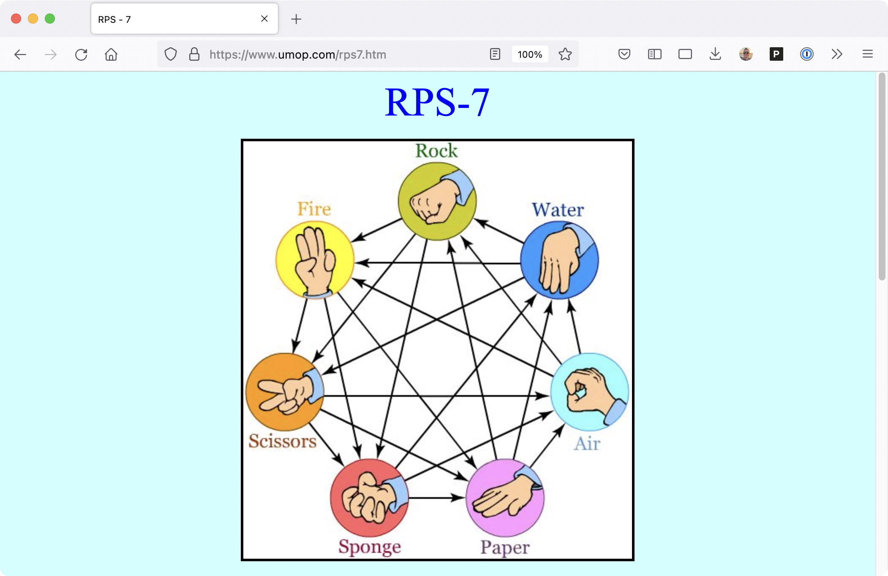
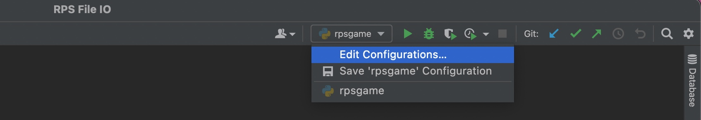
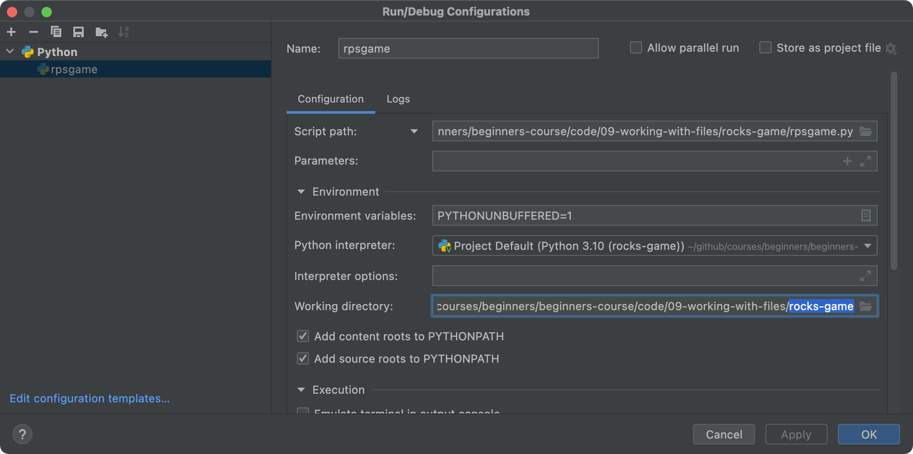
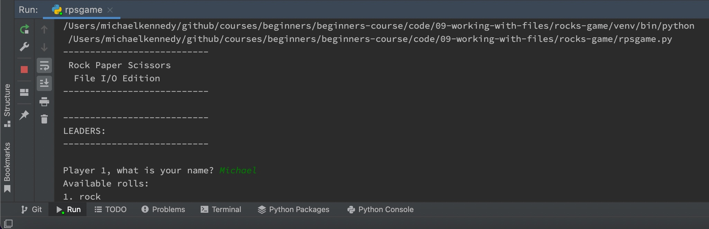
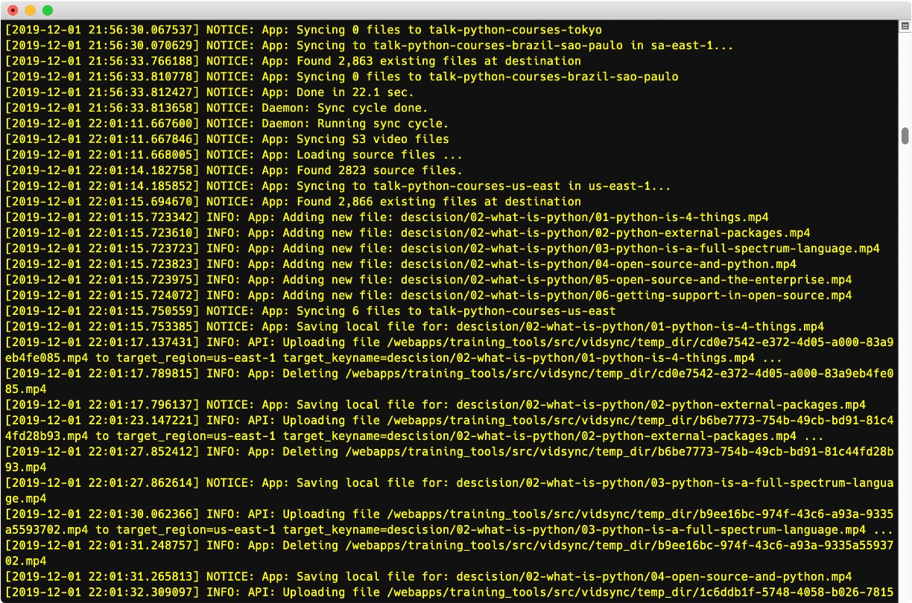
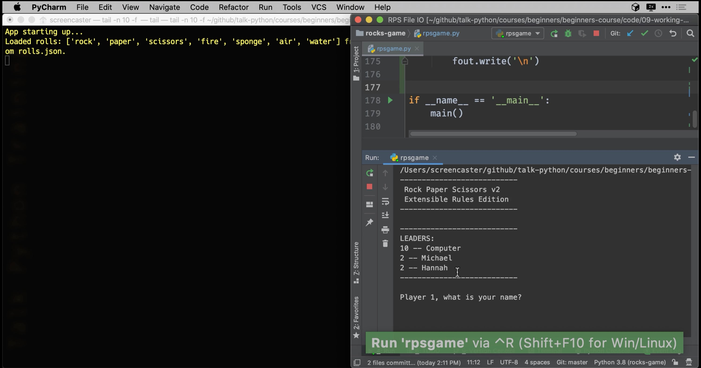
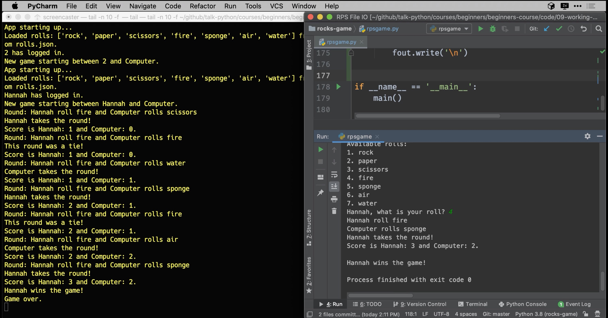
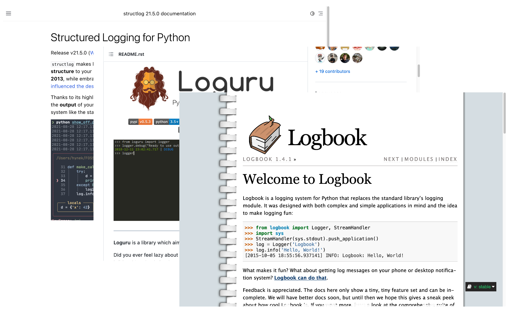

# Gallery: Chapter 09 - Reading and Writing Files

Figure 1: [Max Q is the greatest point of resistence during a launch](figures/0902-maxq.png)

Figure 2: [A text file that defines the rules of our game](figures/0903-extend.png)

Figure 3: [7-way rock paper scissors](figures/0903-rps.png)

Figure 4: [25-way rock paper scissors](figures/0903-rps_2.png)

Figure 5: [Edit Configurations... to configure run details](figures/0906-directory_error.jpg)

Figure 6: [Changing the working directory has consequences (for now)](figures/0906-directory_error_2.png)

Figure 7: [`rolls.json` was not found *in the working directory*](figures/0906-directory_error_3.jpg)

Figure 8: [Printing the result of `os.path.dirname(__file__)`](figures/0906-directory_error_4.jpg)

Figure 9: [Using a path based on the python file fixes the error](figures/0906-directory_error_fixed.jpg)

Figure 10: [Concept example using the `json` module to load a JSON file](figures/0908-concept.png)

Figure 11: [The `json.dump()` method is used to write JSON files](figures/0912-saving_json.png)

Figure 12: [Example of log output from a *real* application](figures/0913-logging.jpg)

Figure 13: [`tail`ing the log of our RPS application](figures/0915-logging_current.jpg)

Figure 14: [Seeing the log file written during start up](figures/0915-logging_app_start.jpg)

Figure 15: [Log file entries for playing an entire round](figures/0915-logging_full_game.jpg)

Figure 16: [Use the mode `'a'` to append to an existing file](figures/0916-appending.png)

Figure 17: [There are many logging frameworks for Python to choose from](figures/0917-logging.png)

**LICENSE**: Images in the figure gallery are copyright and not available for reuse. 

