# Gallery: Chapter 10 - Using External Python Packages

Figure 1: [How are you flying? `pip install antigravity` (actually work in REPL)](figures/1001-antigravity.png)

Figure 2: [Python Package Index - PyPi (prounced Pie-Pea-Eye)](figures/1002-pypi.png)

[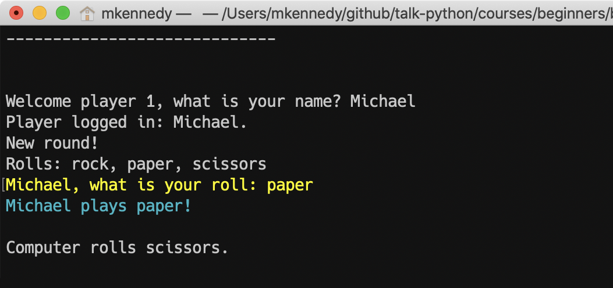](figures/1003-ui.png)
Figure 3: [A little color goes a long way to a better UI](figures/1003-ui.png)

[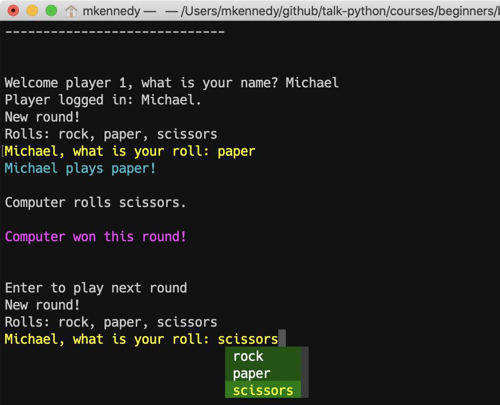](figures/1003-ui2.png)
Figure 4: [We can even add a dropdown/combobox like interface to rolls](figures/1003-ui2.png)

[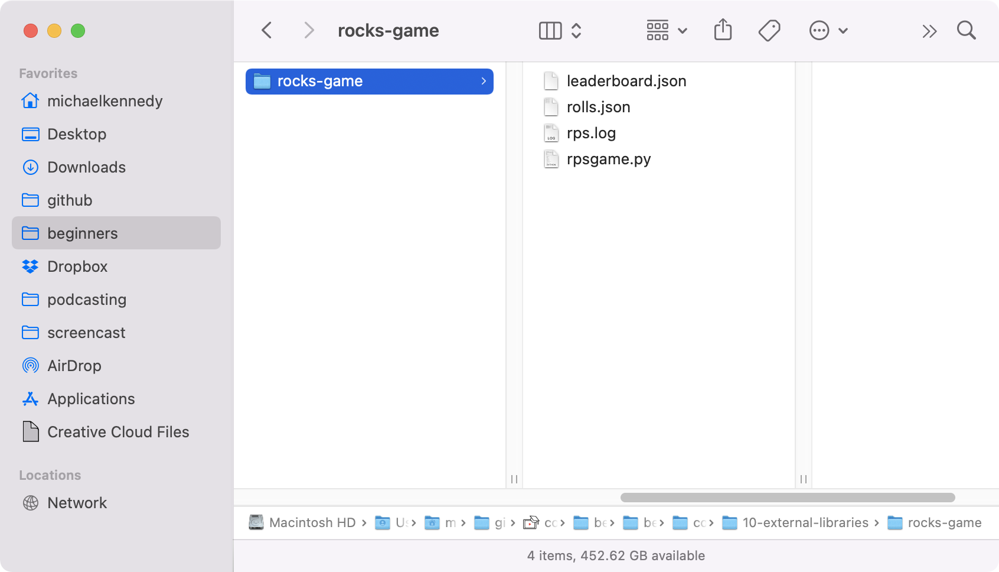](figures/1004-folder.png)
Figure 5: [We will create a virtual environment in our project folder](figures/1004-folder.png)

Figure 6: [Creating a virtual environment (activate with `venv/scripts/activate` in Win)](figures/1004-venv.png)

[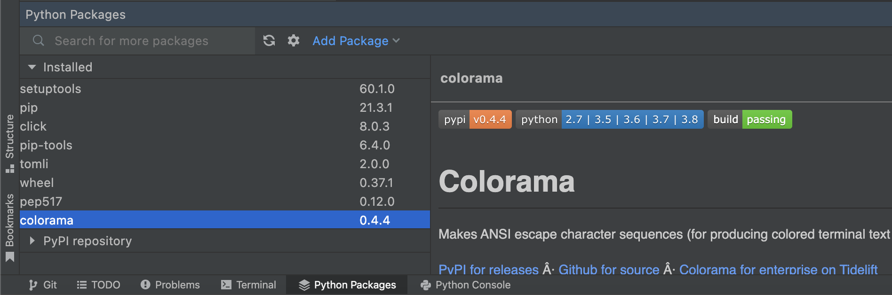](figures/1004-venv_2.png)
Figure 7: [Installed packages listed in PyCharms "Python Packages" window](figures/1004-venv_2.png)

[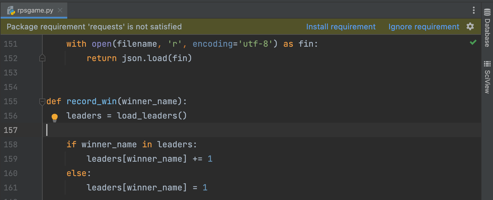](figures/1005-pip_install.png)
Figure 8: [PyCharm will discover and offer to install unfulfilled requirements](figures/1005-pip_install.png)

[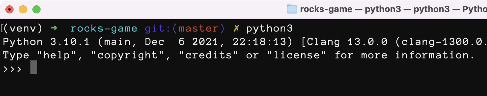](figures/1006-terminal_colors.png)
Figure 9: [By default, this terminal shows only white text](figures/1006-terminal_colors.png)

[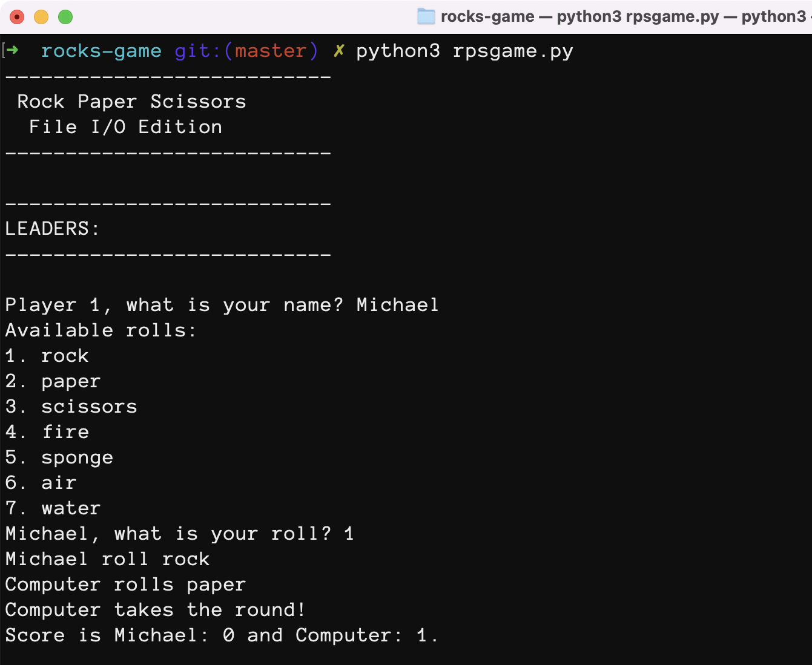](figures/1006-terminal_colors_2.png)
Figure 10: [Our game output also uses the terminal default](figures/1006-terminal_colors_2.png)

[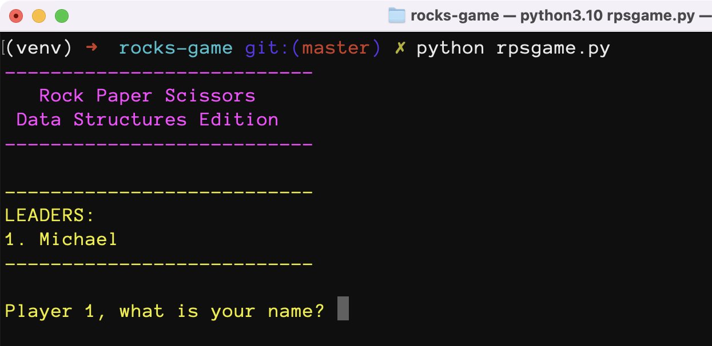](figures/1006-terminal_colors_3.png)
Figure 11: [Colorama allows for very easy color output](figures/1006-terminal_colors_3.png)

[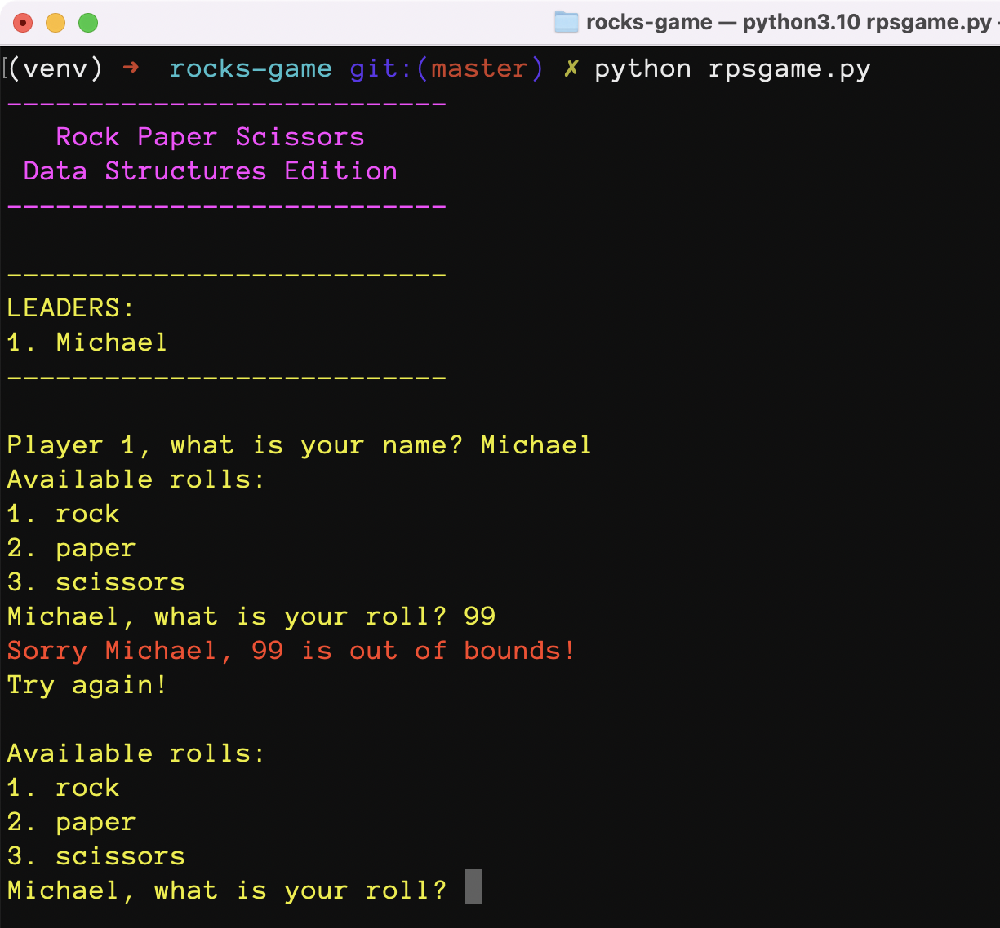](figures/1006-terminal_colors_4.png)
Figure 12: [Error messages in red really stand out](figures/1006-terminal_colors_4.png)

[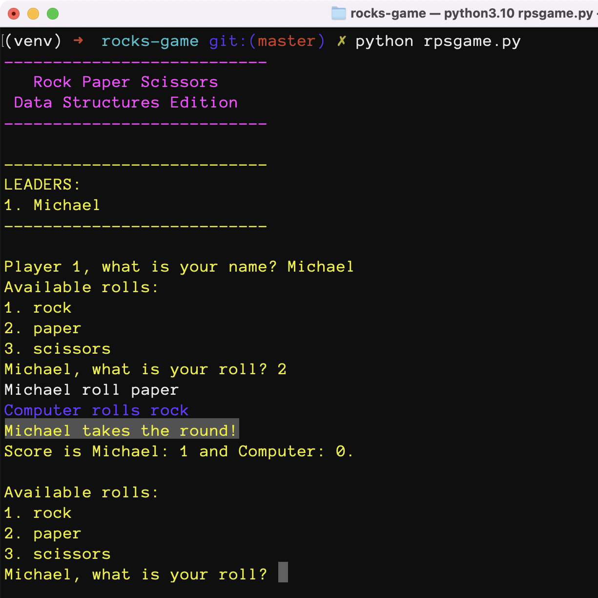](figures/1006-terminal_colors_5.png)
Figure 13: [The winner of a round is not at all obvious](figures/1006-terminal_colors_5.png)

[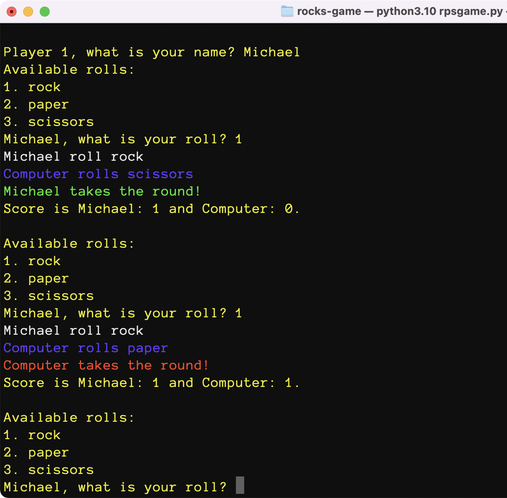](figures/1006-terminal_colors_6.png)
Figure 14: [Now we quickly identity the outcome: green for win, red for loss](figures/1006-terminal_colors_6.png)

[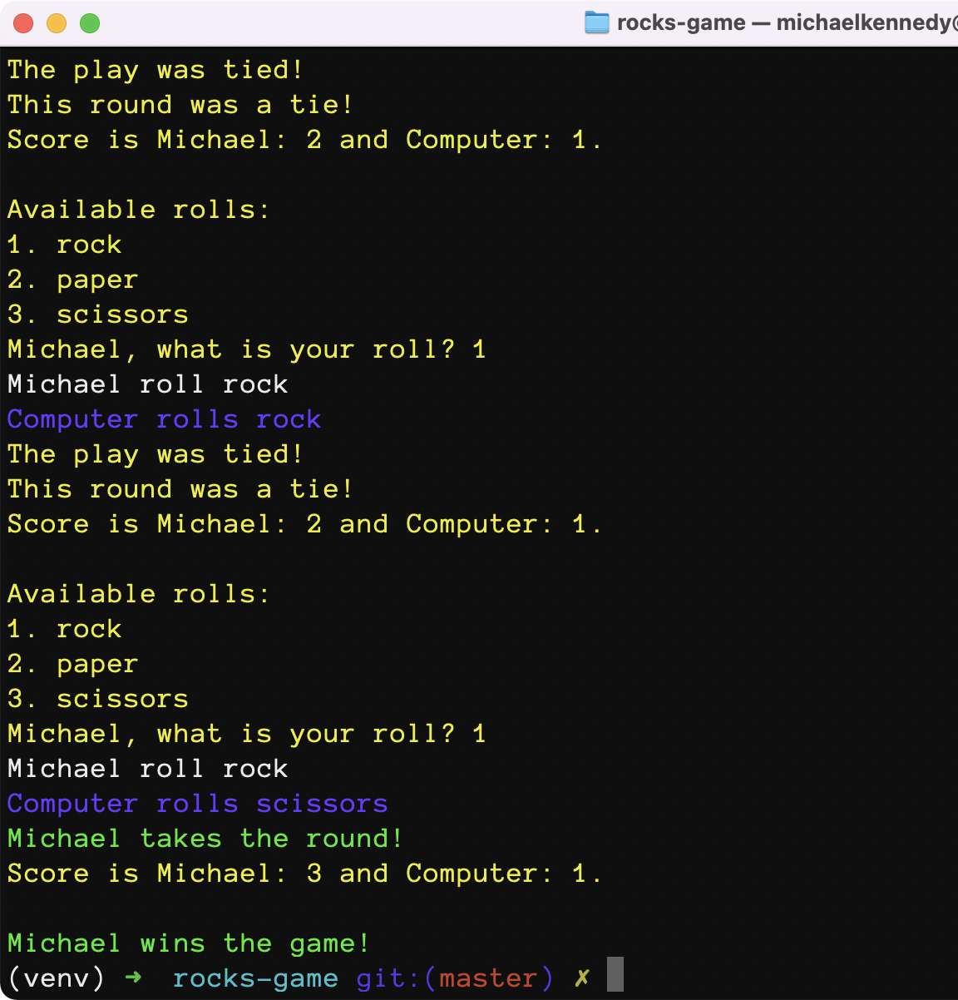](figures/1006-terminal_colors_7.png)
Figure 15: [The overall game winner is also colorized](figures/1006-terminal_colors_7.png)

[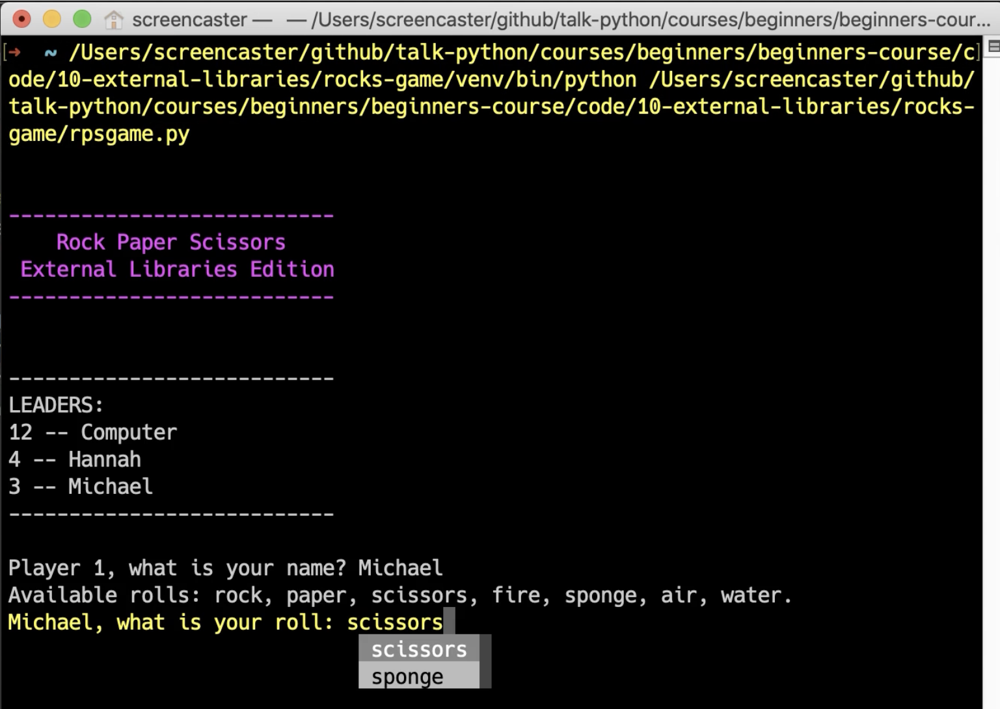](figures/1007-autocomplete.png)
Figure 16: [Autocomplete / dropdown selection *in the terminal*](figures/1007-autocomplete.png)

Figure 17: [`prompt_toolkit` requires a full terminal to run](figures/1007-error.png)

Figure 18: [Now we have customized the dropdown style](figures/1008-dropdown.png)

[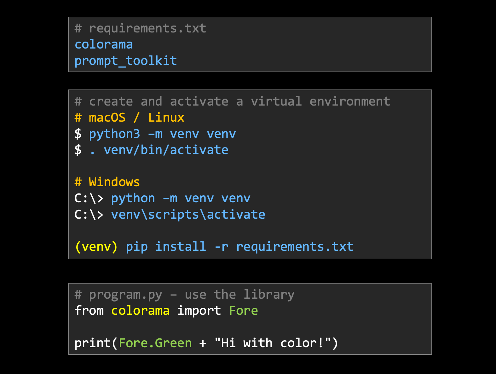](figures/1009-using_external_libraries.png)
Figure 19: [External package workflow: declare, install, use](figures/1009-using_external_libraries.png)

[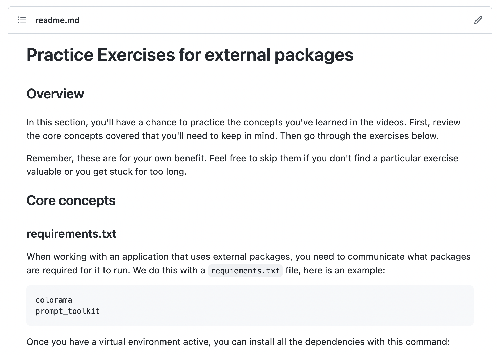](figures/1010-practice.png)
Figure 20: [Be sure to practice working with external packages](figures/1010-practice.png)

**LICENSE**: Images in the figure gallery are copyright and not available for reuse. 

