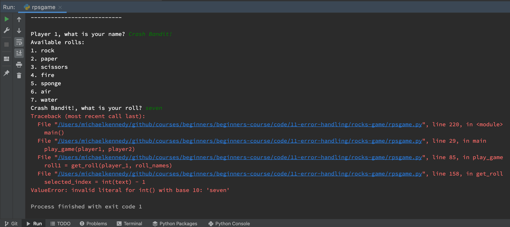
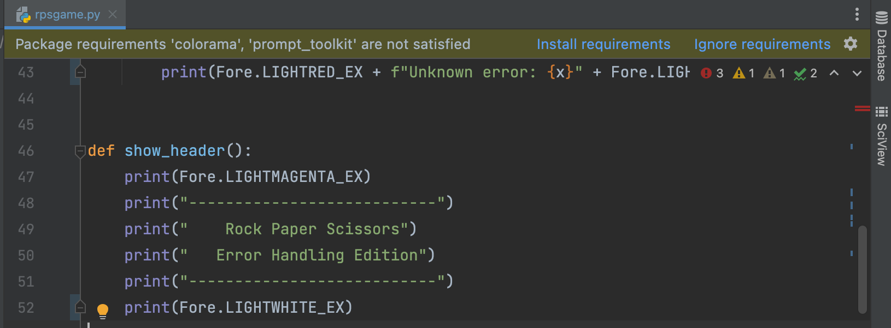
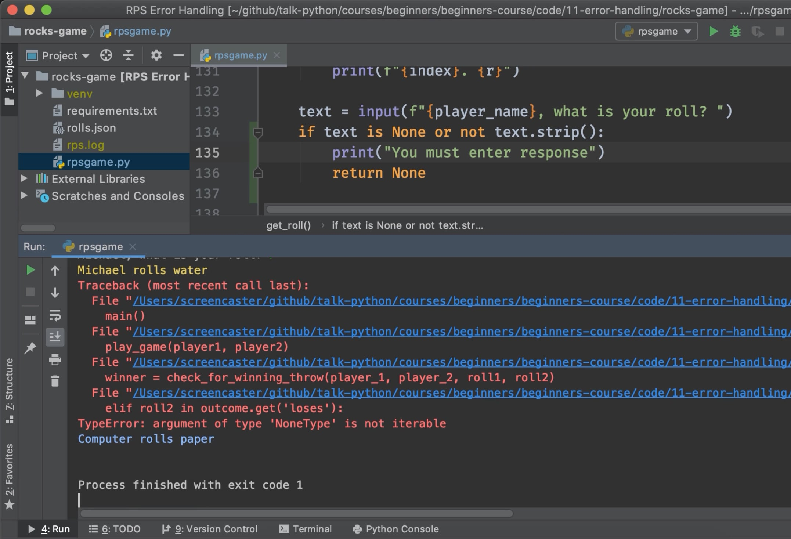
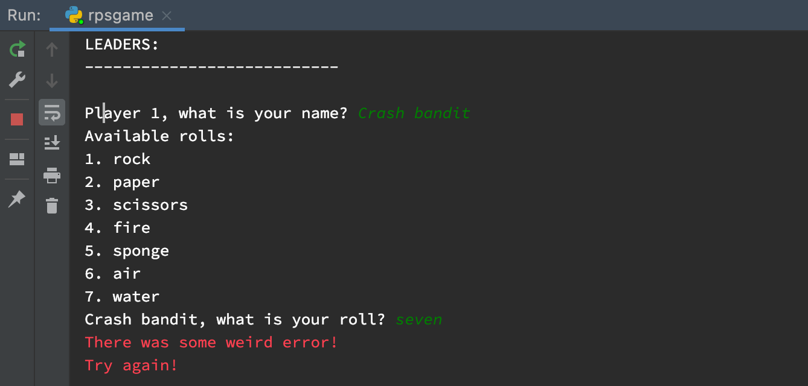
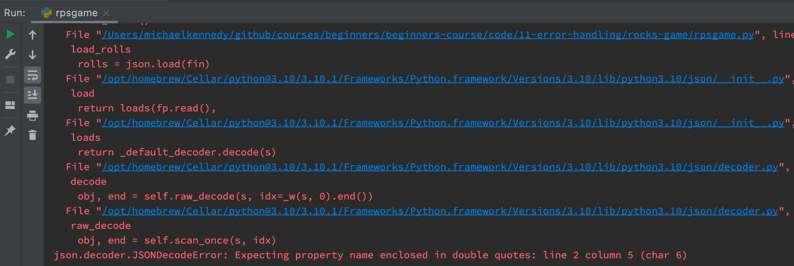
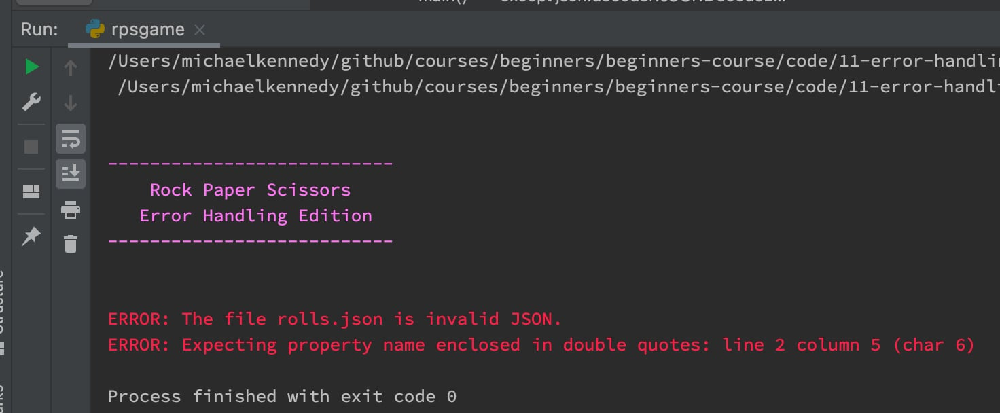
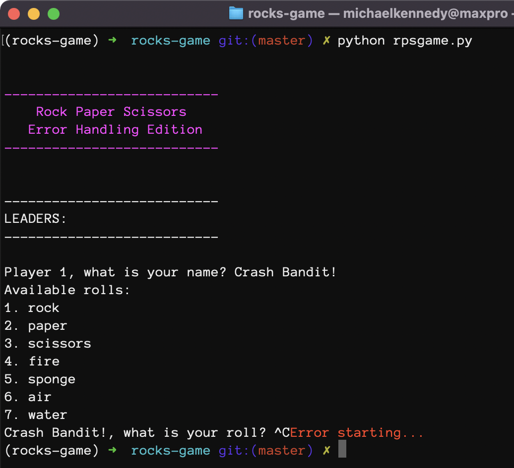
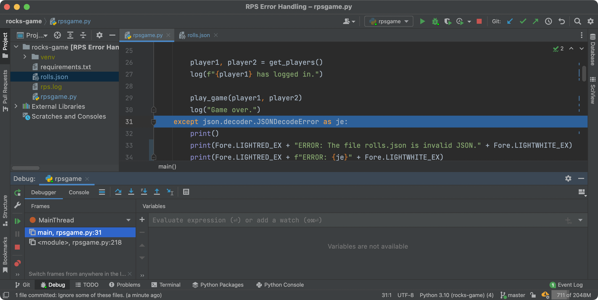
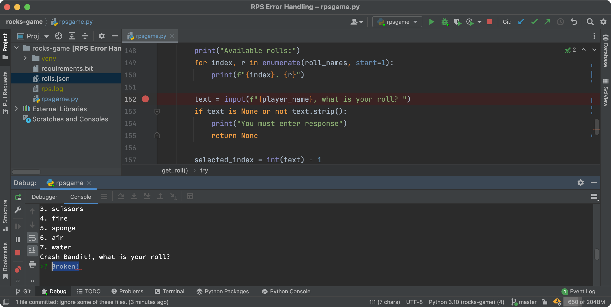
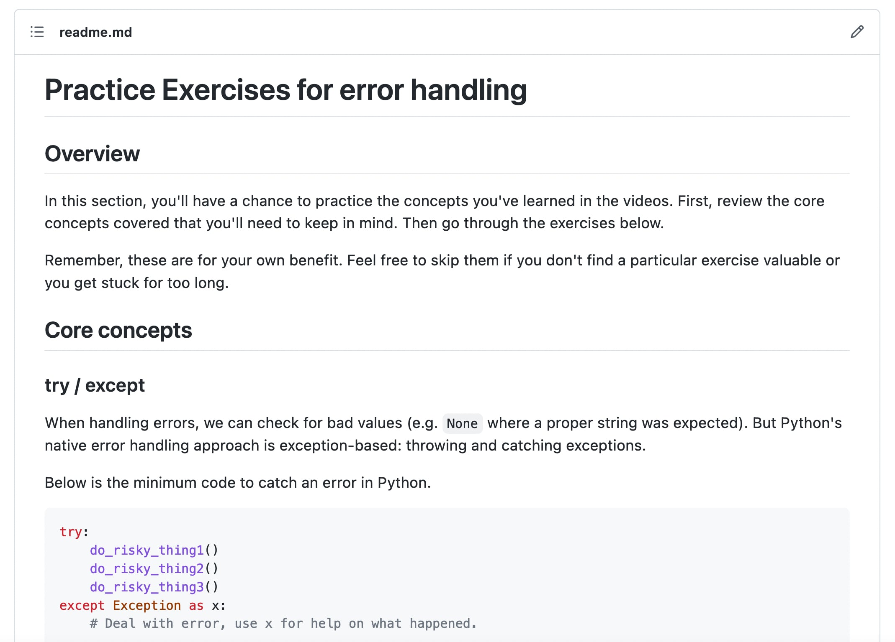

# Gallery: Chapter 11 - Error Handling

Figure 1: [Unhandled errors are the trademark of the amature programmer](figures/1101-error.png)

Figure 2: [We've now working in `11-error-handling` section of code](figures/1102-directory.png)

Figure 3: [PyCharm offering to install stated, but missing, requirements](figures/1102-install.png)

Figure 4: [Code that can raise exceptions should be in a `try/except`](figures/1102-running.png)

Figure 5: [An uncaught exception results in a traceback](figures/1103-error.jpg)

Figure 6: [We've caught the error, but didn't provide details](figures/1103-except.png)

Figure 7: [File format error handling is different than integer conversion errors](figures/1104-error.jpg)

Figure 8: [Catching the json error handles the invalid file formats](figures/1104-detail_error.jpg)

Figure 9: [Seems we are cathcing *overly general* errors](figures/1104-error_2.png)

Figure 10: [Now we see the actual exception that was raised: `KeyboardInterrupt`](figures/1104-keyboard_error.jpg)

Figure 11: [Catching the `KeyboardInterrupt` gracefully](figures/1104-keyboard_error_except.png)

Figure 12: [We also need to handle `FileNotFoundError` in case the file is entirely missing](figures/1104-file_missing_error_except.png)

Figure 13: [The debugger allows us to step through the error handling flow](figures/1105-debug_2.png)

Figure 14: [About to enter invalid input and trigger an exception](figures/1105-debug_3.png)

Figure 15: [Jumping from `int(text)` to `except ValueError`](figures/1105-debug_4.png)

Figure 16: [General `try`/`except` error handling in Python](figures/1106-concept.png)

Figure 17: [Be sure to practice writing error handling code](figures/1107-practice.jpg)

