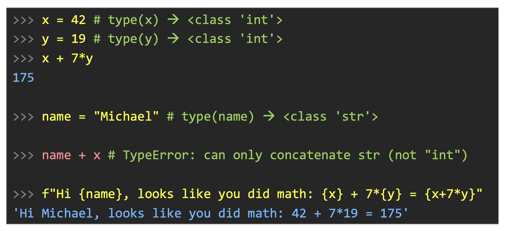
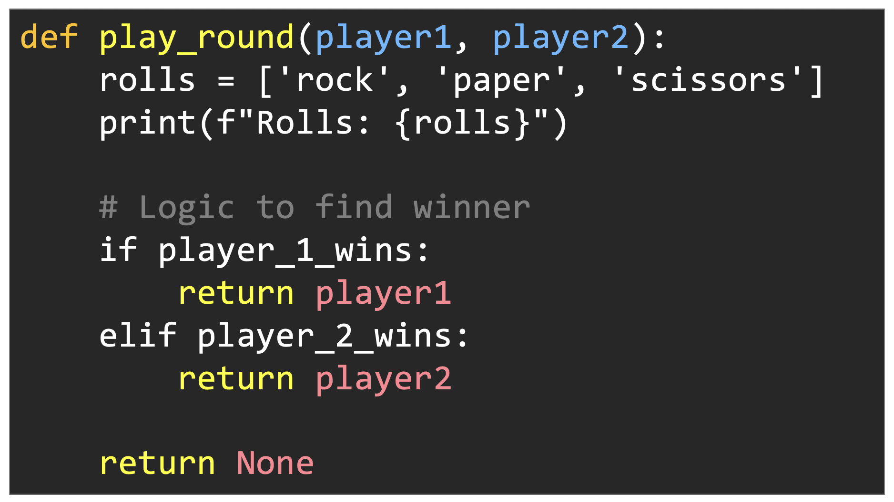
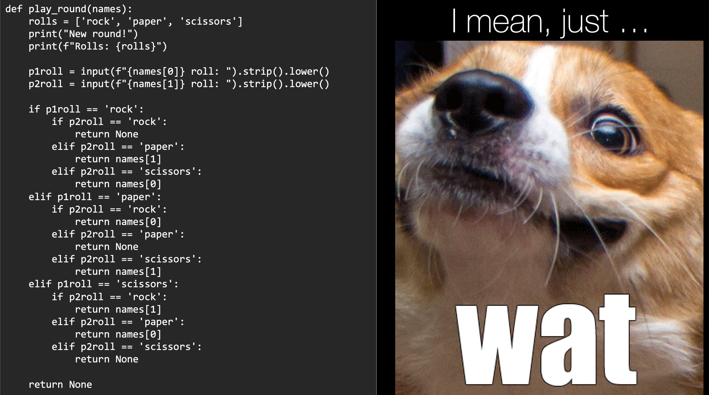
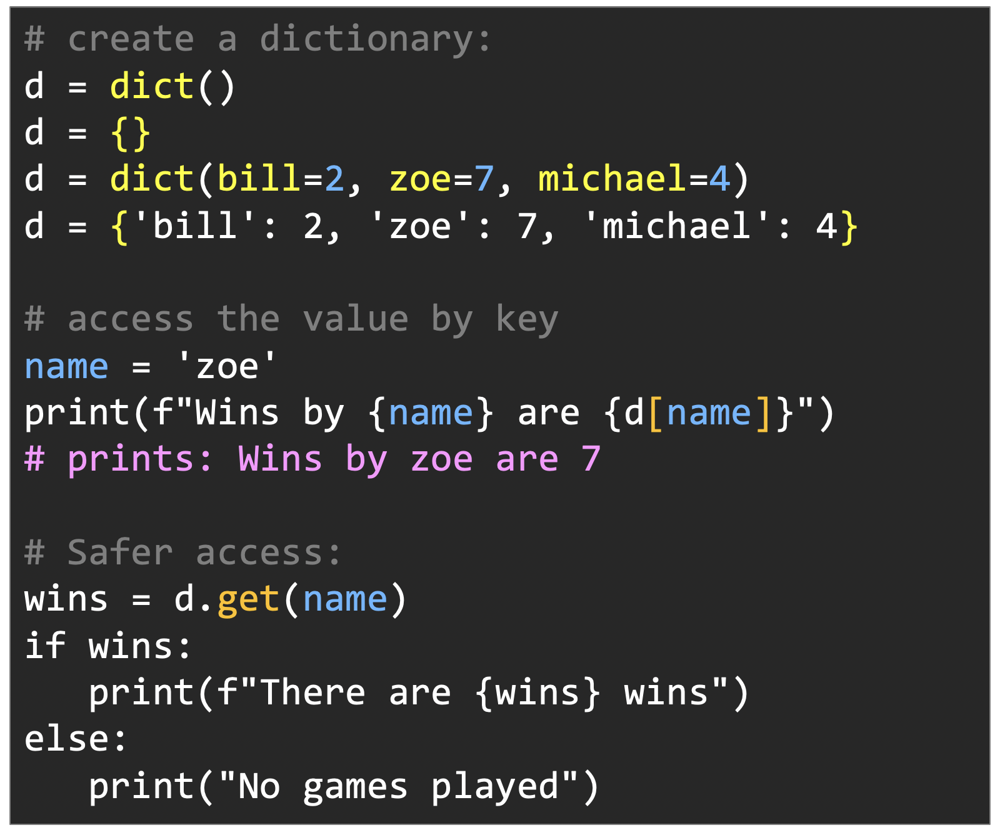
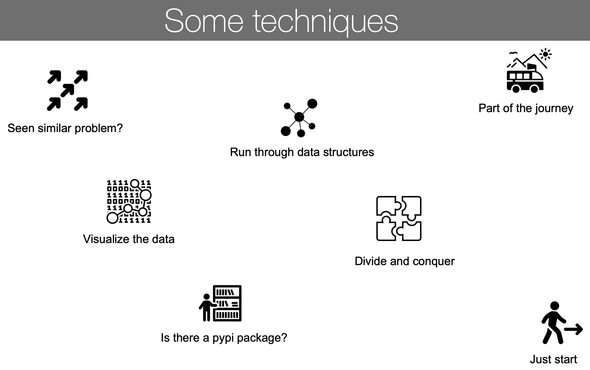
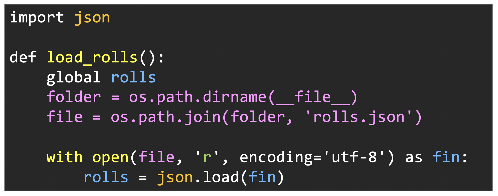
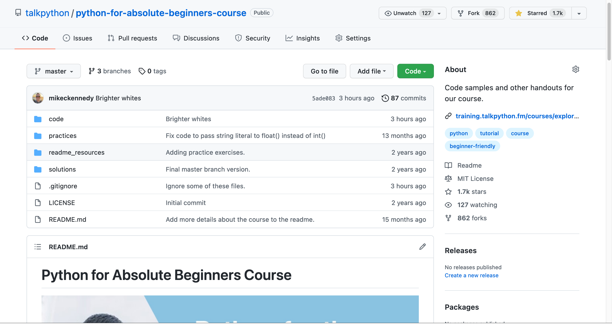

# Gallery: Chapter 12 - Course Conclusion

Figure 1: [Variables have a *type* in Python, even if you don't state it explicitly](figures/1202-variables_types.png)

Figure 2: [Conditional statements are defined with `if`, `elif`, and `else`](figures/1203-conditionals.png)

Figure 3: [Functions allow us to organize and resuse code](figures/1204-functions.png)

Figure 4: [Data structures allow for cleaner, more maintainable code](figures/1205-data_structures.jpg)

Figure 5: [Dictionaries are the most common data structure in Python](figures/1205-data_structures_2.png)

Figure 6: [Keep these problem-solving techniques in mind as you solve problems with code](figures/0802-some_techniques_7.jpg)

Figure 7: [File I/O in Python is straightforward and often has a library to handle the details](figures/1207-file_io.png)

Figure 8: [How are you flying? `pip install antigravity` (actually work in REPL)](figures/1208-external_packages.png)

Figure 9: [Be sure to fork the repo before you go](figures/1209-git.png)

Figure 10: [You've done hours of practice, it's time to get in the game](figures/1210-get-in-the-game.jpg)

**LICENSE**: Images in the figure gallery are copyright and not available for reuse. 

