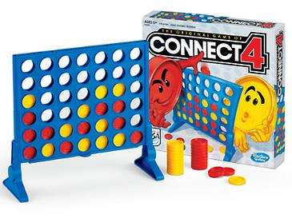

# Practice Exercises for problem solving

## Overview

In this section, you'll have a chance to practice the concepts you've learned in the videos. First, review the core concepts covered that you'll need to keep in mind. Then go through the exercises below. 

Remember, these are for your own benefit. Feel free to skip them if you don't find a particular exercise valuable or you get stuck for too long.

## Core concepts

### Michael's problem solving techniques

Here are a few of the ideas I use to get traction while solving a problem

1. Divide and conquer.
2. Have I seen a similar problem before?
3. Visualize the data ([pythontutor.com](http://pythontutor.com), debugger, `print()`, etc)
4. Run through the data structures (will a well known data structure help this problem?).
5. Is there a [PyPI](https://pypi.org/) package that solves this? Also check [awesome-python](https://awesome-python.com/).
6. Remember this is **part of the journey**.
7. **Just start**, you can adjust as you go and learn more.

## Exercises

Now it's your turn. For this round, you get to dive into a similar experience as we had building [**Tic Tac Toe**](https://www.google.com/search?client=firefox-b-1-d&q=Tic+Tac+Toe) in the videos.

You get to build a **Connect 4** clone. Read more about the game **[on Wikipedia](https://en.wikipedia.org/wiki/Connect_Four)** or try a few rounds over at **[this website](https://www.mathsisfun.com/games/connect4.html)**. 

It should be pretty similar to tic tac toe. But the way a player selects a play is just to choose the column and the state of the board determines which row the puck stops in. Also, you do not need an entire row, column, or diagonal to win, just 4 of a given kind in any of these.

Think about what you saw in the videos (**#2, have I seen a similar solution**), use the right data structure (**#4, Run through the data structures**), and as always, break the problem down to simple parts (**#1, Divide and conquer**).

Also, remember that writing this program is involved. Most likely, it won't be super fast to solve (**#6, this is part of the journey**). Now, create a new blank project and start coding (**#7, just start**)!