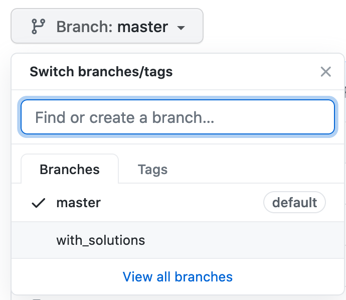

# Solutions: Proceed with caution.

We've decided to include the solutions to the practice exercises. Initially, the intention was to omit them. It can be frustrating. However, **it's working your way through that actually drives the learning**. It feels good to see the solution, but to make it really click, you have to make it your own and work your way through it.

That said, a large number of students have requested that I add these and so here they are.

But, I want to you be sure you want to go down this path. Ideally, this is a *check my solution* type of thing. So we have made the steps a little bit manual. To see the solution, you have to check out the `with_solutions` branch. They do no appear in the default `master` branch (this one). 

You can do this on GitHub by just using the branch dropdown like this:

Then you will see a solutions folder below this one.

Best of luck on the course, Michael!